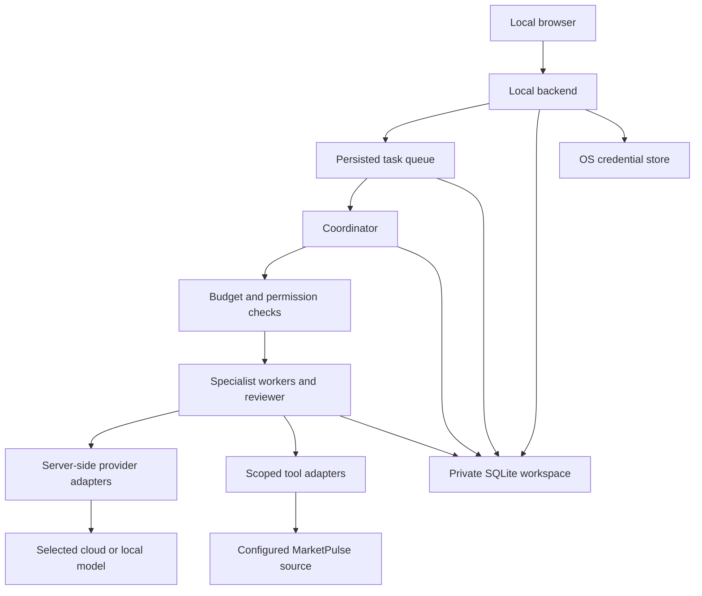

# Maestro development plan

Plan date: 2026-10-01. Status: documentation complete; application implementation has not started. Decisions below are the proposed baseline and will be refined during implementation.

## 1. Product goal

Build a locally bootable personal AI coordinator with a web interface for conversation, to-dos, agent orchestration, and a persistent private memory bank. A task should be able to progress through planning, delegation, review, and refinement with visible progress and enforced resource limits.

The repository will be public. Credentials and all personal workspace data must remain local, outside its checkout. MarketPulse is an intended documentation source; its API, authentication, and document format have not been inspected or assumed.

The first version supports one user on one computer, with Windows as the first supported operating system. Remote hosting, multiple users, unrestricted shell agents, autonomous financial transactions, and automatic application-code rewriting are outside the initial scope.

## 2. User interface

| View | Main controls and information |
| --- | --- |
| Chat | Streaming discussion, relevant memory/source references, and conversion of a message into a to-do. |
| Tasks | Inbox and status board; priority, project, due date, completion criteria, assignment, run/cancel, and execution policy. |
| Runs | Coordinator and agent tree; action timeline, concise progress summaries, tool calls, review passes, artifacts, usage, and stop reasons. |
| Agents | Versioned role prompts, provider/model, output contract, permitted tools, context scope, and per-agent limits. |
| Memory | Search and inspect records; provenance, proposed entries, corrections, deletion, recall controls, and private export. |
| Settings | Provider credentials, model, data location, limits, integration scope, sharing policy, and local backup/restore. |

The Runs view exposes decisions and observable actions, rather than requiring access to a model's hidden reasoning. Local state must survive a browser refresh and application restart.

## 3. Proposed architecture



| Component | Proposed choice | Purpose |
| --- | --- | --- |
| Web interface | React, TypeScript, Vite | Chat, task board, and run inspection. |
| Local API and runner | Python, FastAPI, asynchronous workers | Keep permissions, provider calls, and execution limits in one controlled backend. |
| Storage | SQLite with migrations and FTS5 | Persist tasks, chat, runs, memory, and local text search. |
| Live updates | Server-Sent Events plus normal HTTP requests | Stream chat and task events; replay persisted events after reconnect. |
| Queue | SQLite jobs, leases, and bounded in-process workers | Avoid a separate message broker for a single-user installation. |
| Providers | OpenAI Responses adapter first, mock adapter for tests | Stream output, execute typed tool requests, capture usage, and isolate provider-specific behavior. |
| Credentials | OS credential store; session environment fallback | Keep keys separate from the workspace database and source tree. |
| Tool interfaces | Typed internal adapters initially | Add optional MCP support later where a connector benefits from it. |
| Development setup | uv for Python; a pinned Node package manager and lockfile | Reproducible dependency installation. |

These are project choices, not requirements imposed by a provider. [FastAPI](https://fastapi.tiangolo.com/), [Vite](https://vite.dev/guide/), [SQLite FTS5](https://www.sqlite.org/fts5.html), and [uv](https://docs.astral.sh/uv/) provide the relevant implementation documentation. Pin supported versions during the first build milestone.

The initial packaged application will serve the built frontend from the backend on one loopback origin. A development UI server may proxy to it with an explicit local-origin allowlist. The launcher will check prerequisites, avoid starting duplicate instances, open the browser, and stop its child processes cleanly. Starting Maestro at OS login is a later opt-in feature.

Maestro will own the orchestration loop and use specialists as bounded capabilities. An SDK may be used inside a provider adapter if all model/tool calls pass through the same checks and hosted tracing is disabled by default. The manager approach is consistent with [OpenAI's orchestration documentation](https://developers.openai.com/api/docs/guides/agents/orchestration).

### Public layout and private storage

Proposed source layout, to be created during implementation:

```text
maestro/
  README.md
  DEVELOPMENT_PLAN.md
  .gitignore
  .env.example
  backend/          # API, storage, coordinator, budgets, memory, adapters
  frontend/         # Web interface
  agents/           # Generic role templates only
  tests/            # Mock providers and synthetic fixtures
  scripts/          # Local setup and startup
```

Private runtime layout under `%LOCALAPPDATA%\Maestro` on Windows:

```text
Maestro/
  workspace.sqlite3 # Chats, tasks, runs, usage ledger, memory, settings
  attachments/      # Selected local documents
  artifacts/        # Agent outputs
  logs/             # Redacted operational logs
  exports/          # Explicit private exports
  backups/          # Explicit private backups
```

Use standard per-user data locations on other platforms. Validate and resolve `MAESTRO_DATA_DIR` before opening storage; reject a location within the checkout after resolving links. Apply user-only filesystem permissions where supported. SQLite is not encrypted by default: OS permissions and full-disk encryption are the initial at-rest protection; encrypted portable backups can follow.

The existing `.gitignore` is a backstop, not the primary storage boundary. Add automated secret scanning and checks against accidentally tracked runtime files when CI is introduced. Use synthetic data in all tests and screenshots. GitHub issues, PRs, CI artifacts, and external telemetry must never become an alternative personal memory store.

## 4. Core records and agent roles

| Record | Essential fields |
| --- | --- |
| Task | ID, description, project, priority, due date, criteria, execution policy, status, and run links. |
| Run | Task/context snapshot, parent run, limits, active-time deadline, spend reservations, status, result, and stop reason. |
| Agent profile | Role, versioned prompt, provider/model, tools, context scope, and local overrides. |
| Agent execution | Parent execution, role version, assignment, attempt, structured output, and usage. |
| Event/action | Timestamp, run/execution ID, event type, tool authorization, outcome, and idempotency key. |
| Memory | Text, category, scope, source references, inherited sharing policy, timestamps, confidence, review state, and optional expiry. |
| Usage entry | Provider/model, call ID, input/output usage, estimated price version, reservation, and outcome. |
| Integration | Adapter type, private source address/path, credential reference, and allowed operations. |

Store rendered prompts and source excerpts only in private run records. Allow export with explicit content selection and credential redaction.

Initial generic roles:

- **Coordinator:** clarify completion criteria, create a plan, select specialists, track limits, and assemble the outcome.
- **Work organizer:** break work into useful to-dos, priorities, and next actions.
- **Document analyst:** retrieve permitted documentation, summarize it with source references, and flag missing evidence.
- **Reviewer:** evaluate results against task criteria and give specific feedback or a completion decision.

Each role has separate instructions and a structured output contract: result, references, unmet criteria, suggested next actions, and concise review notes. The same model may serve several roles. Agents cannot grant themselves new permissions or increase their budgets. Provider/model and prompt versions are recorded per run for reproducibility.

## 5. Task lifecycle and bounded refinement

Task states: `inbox`, `queued`, `planning`, `running`, `reviewing`, `awaiting_input`, `paused`, `completed`, `failed`, `cancelled`, and `budget_exhausted`. A run can end with a partial result and an explicit stop reason. A to-do is marked completed only when its completion criteria are met.

1. Save the to-do locally. With the default `manual` policy, wait for Run. With a configured `auto` policy, queue eligible tasks under the same limits.
2. Snapshot criteria, relevant context, agent versions, integration scope, and budgets. Ask for missing information only when it prevents meaningful execution.
3. Plan bounded subtasks. Before every delegation, model call, and tool action, check the persisted budget, cancellation flag, and permissions.
4. Delegate to specialists with the minimum required context. Child agents may delegate only within the shared depth and total-agent limits.
5. Validate structured results and review against explicit criteria. If complete, assemble the result. If incomplete, revise the assignment and repeat within the existing limits.
6. Stop on completion, no meaningful progress, exhausted limits, cancellation, or a required user decision. Keep the best partial result and explain the unresolved work.
7. Record feedback and proposed memory/prompt improvements under the configured memory policy. Those calls also consume budget.

Persist events and action status before advancing. Worker leases prevent duplicate claims. After a crash, show interrupted runs for explicit recovery; reconcile uncertain actions before retrying them. Use idempotency where supported and do not blindly replay external writes or timed-out provider requests. Resuming or retrying preserves consumed usage and needs a new explicit allowance if the old run is exhausted.

## 6. Cost and execution controls

Proposed conservative defaults, to be adjustable in Settings. Dollar amounts are user budget choices in USD, not model pricing claims.

| Limit | Initial proposal |
| --- | --- |
| Automatic execution on to-do entry | Off; configurable per task category/project |
| Spending per task run | USD 1.00 |
| Daily / monthly spending | USD 5.00 / USD 50.00 |
| Review cycles | 3 total: initial review and at most 2 refinements |
| Delegation depth | 2 below the coordinator; coordinator is depth 0 |
| Total specialist executions | 6, counting new execution attempts |
| Concurrent specialist executions | 2 globally |
| Model requests per run | 20, including coordinator, review, summaries, and retries |
| Tokens per run | 100,000 input + output combined, including provider-reported reasoning usage |
| Tokens per request | 8,000 input and 2,000 output; reject or trim context before dispatch |
| Tool invocations per run | 30, with per-tool timeouts |
| Active run time | 10 minutes; persisted active-time accounting pauses while waiting for the user |
| Automatic transient retries | At most 2 per request, inside all other limits |

Implementation requirements:

- Apply the same call gate to ordinary chat, key connection tests, background work, and task runs. Chat turns use a bounded execution record even when no to-do exists.
- Reject paid calls when no trusted pricing configuration exists for the selected model/tool. Use conservative input estimates, bounded output, and known tool charges to reserve the maximum expected request cost before dispatch.
- Atomically reserve spend and token capacity across concurrent runs in SQLite. Settle reservations from usage data; keep uncertain charges reserved after failures until reconciled. Avoid double-counting reasoning tokens already included in output usage.
- Aggregate all descendants, retries, tool fees, and memory work into the parent run and local day/month ledger. Use the user's configured timezone for calendar boundaries; do not reset budgets on restart.
- Stop dispatching when any limit is reached. Repeated equivalent plans or review failures trigger a no-progress stop. A Cancel or emergency-stop action blocks new calls and cooperatively interrupts workers.
- Persist consumed usage across pause/resume. Budget increases and emergency-stop reset must be explicit user actions; agents cannot do them.
- Show estimated spend separately from provider billing. In-flight calls can still incur charges after cancellation, and requests made outside Maestro are outside its ledger. Reconcile with provider usage where available and use a dedicated provider project/key where practical.

These controls must be implemented in application code before autonomous execution is enabled. Prompt instructions alone cannot enforce them.

## 7. Private memory and continuous improvement

Memory serves future chats and tasks while remaining inspectable and reversible. Categories include user-approved preferences, project context, decisions, task lessons, and workflow guidance. Credentials are never memory entries.

Start with SQLite text search and a bounded recall context. Keep each memory's provenance, scope, confidence, review state, and optional expiry. Prefer explicit user corrections over prior inferred memories; surface conflicts rather than silently treating an inference as fact. Retrieved documents and recalled content are untrusted input and cannot override permissions or system rules.

The initial policy saves explicitly requested memories and presents inferred entries for review. A later opt-in policy can automatically save selected low-risk categories with an audit history. Provide edit, forget, project isolation, recall disable, and private export controls. Deletion removes live records, FTS entries, derived summaries, and cached embeddings if introduced; disclose that previously exported files and backups need separate removal.

Improvement cycle: collect feedback, record a concrete lesson, propose a prompt/workflow revision, test it against synthetic or explicitly selected private evaluation cases, then allow promotion and rollback. Keep generic shipped prompts in Git and personal overrides in the private database. Automated promotion can be added as an opt-in policy with a fixed evaluation budget and regression criteria. Runtime agents do not mutate application source or publish memory to GitHub.

Memory extraction, compaction, embeddings, and evaluations are subject to the same call gate and usage ledger. No unbounded idle-time reflection jobs. Add backup/restore before relying on memory as durable project knowledge; backups remain outside the checkout.

## 8. Credentials, privacy, and integrations

Bind the initial service to loopback only. Require a local session, validate Host and Origin headers, enforce CSRF protection for changes, and allow only configured local frontend origins. A local website must not let unrelated websites read memory or change settings. Remote/LAN access requires a separate authentication and transport design.

The Settings form may hold a newly entered key transiently while submitting it to the local backend, then clears it. Save in the OS credential store; expose only status through APIs. No keys in browser storage, frontend environment variables, logs, exception bodies, database rows, or prompt context. If a secure credential store is unavailable, support session-only credentials or a server process environment variable and make persistence behavior clear. [OpenAI authentication guidance](https://developers.openai.com/api/reference/overview#authentication) supports keeping provider keys on the server.

Default operational logs contain event IDs and redacted metadata. Content-rich run history remains private; hosted tracing and telemetry are off by default. Display which provider receives context, and allow projects/documents to be marked local-only. Derived summaries, memories, artifacts, and agent handoffs inherit the most restrictive source-sharing policy; recalling a memory cannot bypass it. A cloud adapter must reject dispatch if selected content violates that policy. Keep conversation history and search indexes local; prefer selected text excerpts over provider-hosted document uploads. For OpenAI, request `store: false` and check feature-specific retention before adding hosted tools. This is not a promise of zero provider retention; see [OpenAI data controls](https://developers.openai.com/api/docs/guides/your-data).

MarketPulse connector sequence:

1. During its milestone, identify the user-selected API, export, or document directory and authentication method.
2. Configure private source details and allowlisted endpoints/directories in local Settings. Do not discover or crawl neighboring repositories automatically.
3. Implement read-only search and document retrieval with normalized source IDs, document dates, and citation metadata. Mock the contract with synthetic documents first.
4. Enforce path containment after resolving links, operation allowlists, timeouts, file-size limits, and document-specific provider-sharing policy.
5. Include references and retrieval dates in analyst outputs; report unavailable, stale, or contradictory sources. Preserve the distinction between retrieved evidence and the agent's interpretation.

Any future tool that modifies an external system needs scoped authorization, an audit record, and an idempotent or reviewable action contract. Unrestricted shell/file access is not part of the initial agent toolset.

## 9. Milestones and acceptance criteria

### M0 - Public foundation and documentation

- [x] Document the vision, privacy boundary, architecture, and development sequence.
- [x] Add Git exclusions and a blank configuration example.
- [x] Audit repository history and publication files for secrets and private runtime data.
- [x] Confirm public visibility and enable secret scanning with push protection.

### M1 - Bootable local chat and configuration

Build the web shell, local backend, Windows startup/shutdown scripts, private storage migrations, session protection, Settings, mock provider, and OpenAI adapter. Include the call gate and spend ledger for chat from the start.

Acceptance: a clean checkout can be installed and started using documented commands; the browser opens on loopback; storage is outside the checkout; chat/history survives restart; keys can be added/removed without leaking to browser storage, API reads, logs, or Git; a mock conversation requires no key or network; missing credentials/pricing block paid requests; local-only context cannot be sent to a cloud provider.

### M2 - To-dos, execution, and run browser

Build task CRUD, priorities/projects, criteria, persisted queue, run events, results, and start/cancel/pause controls. Default to manual execution and support explicitly enabled execution-on-entry policies. Finish all run-level and global budgets before enabling auto execution.

Acceptance: entering a to-do persists it and queues it only under its configured policy; the browser displays status and usage live; reconnect replays events; restart retains history without duplicating actions; cancellation and exhausted limits prevent new dispatches; concurrent work cannot oversubscribe spend/token reservations.

### M3 - Specialist agents and bounded refinement

Add role templates and local overrides, delegation trees, structured outputs, reviewer criteria, child limits, and no-progress detection.

Acceptance: a synthetic task delegates to distinct roles; a deliberately incomplete result triggers focused refinement; completion, failure, and each configured limit end with a visible reason; grandchildren inherit remaining permissions and budgets; agent requests to raise limits are rejected.

### M4 - Persistent memory and feedback

Add scoped search/recall, explicit remember/forget, reviewable inferred records, correction precedence, local prompt revisions, evaluation/rollback, and backup/restore.

Acceptance: later chats use relevant approved memories with inspectable references; private projects stay isolated; corrections take precedence; forget removes live records and derived indexes; backup/restore works; improvement jobs are bounded and credentials never enter memory.

### M5 - MarketPulse document access

Implement the selected read-only connector and analyst output citations. Keep all real integration configuration and documents outside Git.

Acceptance: a synthetic connector test retrieves and cites scoped documents; out-of-scope paths/endpoints are rejected; live access works only after local configuration; unavailable sources yield a useful partial result; local-only material stays off cloud providers.

### M6 - Optional automation and provider expansion

Add opt-in schedules, provider capability negotiation, a local-model adapter, and more scoped integrations. Add any remote-access mode only with a separately reviewed authentication design.

Acceptance: idle automation has a fixed allowance, survives restart without duplicate scheduling, and stops at limits; changing providers preserves private local history; local-model operation can run without cloud API requests; emergency stop covers every scheduled and interactive execution path.

The MVP checkpoint is M1-M3: a local chat/task interface with visible, bounded multi-agent work. The complete initial vision additionally requires M4-M5 for persistent assistance and MarketPulse access.

## 10. Verification and next implementation step

Use mock providers and synthetic content in automated checks. Cover lifecycle transitions, budget reservations under concurrency, timeout/cancellation, crash recovery, credentials/redaction, origin/session validation, path containment, memory isolation/deletion, and connector permissions. Use browser-level checks for chat, task entry, run inspection, and restart persistence. CI must not call paid APIs or require personal credentials.

Keep any live provider smoke tests opt-in with an explicit small budget and local credentials. Record dependency versions and setup instructions at M1; update milestone status only when its acceptance checks pass.

Next step: implement M1 as the first usable vertical slice - startup, private workspace, Settings, and one bounded chat - then build task execution and specialist orchestration on that foundation.
