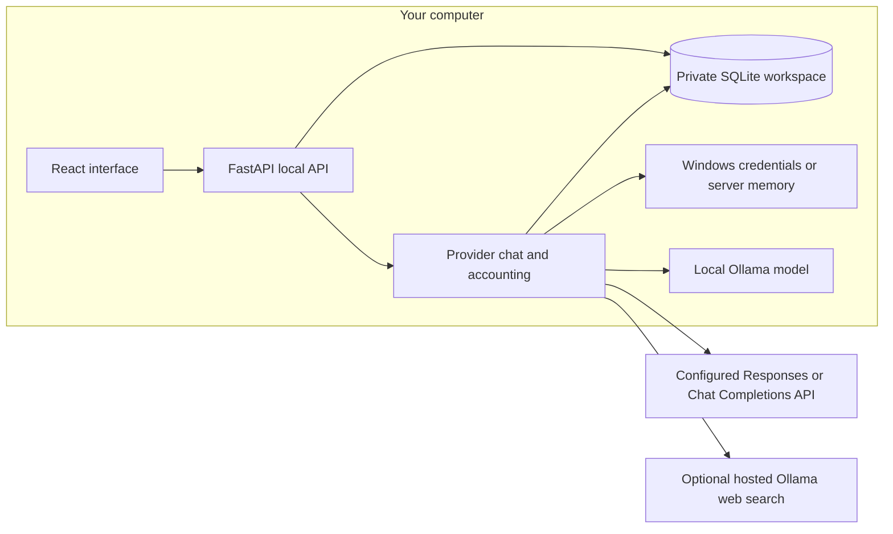

# Maestro architecture

Maestro's current runtime is a local chat application with persistent manual tasks. It has one active provider/model configuration and no coordinator, task worker, delegation or automatic memory recall.

## Implemented boundaries

The built frontend is served by FastAPI on one loopback origin. Workspace contains chat, Tasks contains manual to-dos, and Settings configures the active model, credentials, search and limits. The header and usage view report actual model usage and estimated spend.

`backend/app.py` owns session/CSRF protection, request validation, chat/task CRUD and workspace snapshots. `backend/provider.py` owns the single provider configuration, conversation dispatch and persistent reservation ledger. `backend/web_search.py` owns search credentials, readiness and attempt limits. Workspace and status reads avoid writes after initial migration. SQLite updates use immediate transactions; provider requests run outside database locks. This is a single-server runtime, not yet a queue shared by multiple processes.

Ollama uses its native API on loopback, accepts installed local chat models and has no cloud fallback. The alternative adapters use Responses or Chat Completions at the configured endpoint. Model selection is saved in Settings; there are no independently configured specialist models. Chat waits for a complete response and sends only the selected chat's history as context.

Chats have stable IDs, separate message lists and editable titles. Workspace responses include chat summaries, `active_chat_id` and the selected chat's messages; generation captures an explicit chat ID. New chat preserves existing conversations. Deletion removes a chat's content while retaining the shared usage ledger, and is blocked while that chat has a reserved request. Previous live history migrates once into one conversation. Projects remain a later feature.

Task creation, completion/reopening and deletion only update local records. A task has no model call or background execution attached to it. There are no tools for repository changes, integration access or agent handoffs.

## Generation and usage

1. Read the active model configuration and the requested chat's context.
2. Check context/output token limits and configured spend allowances. Reserve conservative estimated usage in an immediate transaction.
3. Dispatch one generation, or the bounded Ollama search flow described below. The reservation permits one chat request at a time.
4. Persist the reply and settle provider-reported token usage with the configured price snapshot. After a chat's first successful exchange, optionally generate its title once with the original model and remaining request allowance. The title call uses a bounded first message and no tools, and is skipped if model settings change. Failure keeps the first-message fallback and the successful reply; a manual rename wins over a delayed generated title. Unknown paid title usage still requires reconciliation.
5. Keep unresolved paid usage reserved until the user verifies and reconciles its amount. Known access/quota rejections and zero-cost local failures release their reservations.

Local model API charges are zero; hardware and electricity costs are outside this accounting. Remote charges are estimates from saved prices, not invoices. Earlier entries keep their recorded prices. An API restart marks interrupted paid requests uncertain. This startup recovery assumes there is no independent live worker and must change before cross-process dispatch is enabled.

## Optional search

When automatic search is explicitly enabled and a separate search key has been tested, a tool-capable local Ollama model may request one `web_search`. The backend accepts only that tool, sends the chosen query to `https://ollama.com/api/web_search`, then supplies bounded, untrusted excerpts to one final local generation with tools removed. Query and source links persist beside the answer.

At most one search and two model calls are allowed for an answer; a one-time title call may use the remaining request allowance. The answer calls share the output allowance and cumulative token check; known usage remains accounted if search or the final response fails. Search tests and interrupted/failed attempts count toward the daily cap. One in-flight search, five-second spacing, a 30-second timeout, response-size limits and provider cooldowns apply. There are no automatic retries or result-page fetches. Hosted search fees are unknown and excluded from local inference's zero API cost.

This is a bounded tool call inside chat. It does not delegate a task or create an autonomous agent.

## Private state and credentials

Tasks, live messages, limits, provider settings and ledgers live in a SQLite database outside the checkout. The default directory is `%LOCALAPPDATA%\Maestro\preview`; `MAESTRO_DATA_DIR` must also resolve outside the repository. Provider and search credentials live in Windows Credential Manager or server memory. The OpenAI endpoint can use a server-environment key fallback. Read APIs expose credential presence, never key values.

The API validates Host and Origin, requires a local session and protects mutations with CSRF checks. Remote provider requests send the selected conversation history to that provider; Ollama sends it to the local server. OpenAI requests set `store: false`. The repository and synthetic test fixtures contain no private workspace records or personal credentials.

The cleanup removes demo seeding, simulated runs and accounting, memory endpoints and the reflection runtime. Earlier prototype-only workspace records remain archived in the same private database, and reflection tables remain untouched. Simulated messages are excluded from active chat and provider context. Real messages, manual tasks, provider configuration and accounting remain active.

## API surface

| Routes | Purpose |
| --- | --- |
| `GET /health`, `GET /api/session` | Local health and session/CSRF setup. |
| `GET /api/workspace?chat_id={id}` | Chat summaries, selected messages, tasks, limits, shared usage and capability status; selection is optional. |
| `POST /api/chats`, `PATCH /api/chats/{id}`, `DELETE /api/chats/{id}` | Create, rename or delete a conversation, retaining accounting. |
| `POST /api/tasks`, `PATCH /api/tasks/{id}`, `DELETE /api/tasks/{id}` | Manual task persistence. |
| `POST /api/chat` | Generate a reply for the submitted `chat_id` and persist it in that conversation. |
| `GET /api/provider`, `PUT /api/provider`, `POST /api/provider/test`, `DELETE /api/provider/key` | Active connection settings, model-list access and credential removal. |
| `POST /api/provider/charges/{id}/reconcile` | Settle a provider-verified uncertain amount. |
| `GET /api/web-search`, `PUT /api/web-search`, `POST /api/web-search/test`, `DELETE /api/web-search/key` | Search readiness, settings and separate credential lifecycle. |
| `PUT /api/limits` | Save the enforced chat spend/token allowances. |

## Next build sequence

The [Podman deployment backlog](../DEVELOPMENT_PLAN.md#podman-deployment-backlog) runs alongside this functional sequence. Its planned baseline is one application container with persistent private storage and the existing host Ollama service. Container networking, credential storage, migration, lifecycle and deployment checks must pass before it becomes a supported runtime; keep one API owner per workspace until worker ownership and leases are implemented.

1. **Shared generation service.** Extract dispatch/accounting from conversation handling. Each call accepts an explicit model profile and selected context, captures an immutable configuration snapshot and uses one shared reservation ledger. Chat remains a caller of the service; task context does not reuse chat history automatically. Preserve current search and uncertain-charge behavior.
2. **One durable task worker.** Start a separate Maestro process that claims a manually queued text-only task, generates with local Ollama and saves a result. Persist claims, attempt ownership, leases, progress, pause/cancel and cumulative call/token/time limits. Keep one generation slot initially, allowing chat between task steps. Make reservation recovery ownership-aware: API restart must not release a live worker's reservation, and stale attempts cannot commit a result after a newer claim. Verify completion with the browser closed, pause, limits and restart recovery before adding more execution paths.
3. **Multiple saved profiles.** Store named local/remote model connections with endpoint-scoped credential references and explicit context-sharing choices. Select a profile for a task and record it per call. Verify installed-model capabilities, switching and one-model residency, accounting and local-only restrictions before automatic selection. Measure memory and task quality to choose role defaults.
4. **Bounded delegation and review.** Give a coordinator a typed way to assign one child task with selected context, profile, criteria and a share of the parent's allowance. Persist the handoff and result. Add reviewer-driven revision only with shared call/token/time limits and completion, cancellation and no-progress stops. Prove different profiles can serve distinct assignments before expanding the agent tree.

Memory recall, scoped integrations and isolated coding tasks build on that execution path. Add their UI when their underlying behavior works. The [development plan](../DEVELOPMENT_PLAN.md) records the product goals and acceptance checks.
