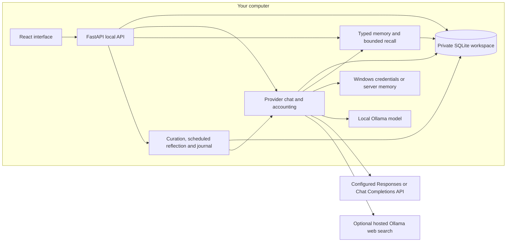

# Maestro architecture

Maestro's current runtime is a local chat application with persistent user-created and reviewed AI-created tasks, private memory and opt-in background reflection. It has one active provider connection and bounded local recall. Task execution, coordination and delegation remain planned.

## Implemented boundaries

The built frontend is served by FastAPI on one loopback origin. Workspace contains chat, Tasks contains attributed to-dos, and Memory contains the map/list, source evidence, proposals and reflection journal. Settings configures models, credentials, search, reflection and limits, with links to Memory and usage. The header and usage view report actual model usage and estimated spend.

`backend/app.py` owns session/CSRF protection, validation, CRUD and the application lifespan. `backend/provider.py` owns the single connection, shared generation slot and usage ledger. `backend/reflection.py` owns durable idle jobs, source validation, two-stage curation, scheduled working notes and a private journal. `backend/work_config.py` validates private task models and worker policy; `backend/memory.py` owns accepted records and read-only recall. `backend/web_search.py` owns search readiness and limits. Reads avoid writes after initialization. SQLite writes use immediate transactions; generation runs outside locks. One worker runs inside the sole API process under exclusive workspace ownership.

Ollama uses its native loopback API, accepts installed local models and has no cloud fallback. Other adapters use Responses or Chat Completions. The UI always uses the chat role, with a model-name picker and saved Qwen preference when available. The API retains an orchestrator model preference without task execution. Chat sends the selected conversation and optional local memory; the frontend progressively reveals the completed backend reply and renders safe Markdown. Reflection receives explicitly selected bounded evidence/memory, without implicit recall, tools, hosted search or conversation titles. Chat curation forms then reviews facts/preferences; scheduled reflection forms then reviews identity/lesson notes. Both use one shared slot and at most two calls.

Chats have stable IDs, separate message lists and editable titles. Workspace responses include chat summaries, `active_chat_id` and the selected chat's messages; generation captures an explicit chat ID. New chat preserves existing conversations. Deletion removes a chat's content while retaining the shared usage ledger, and is blocked while that chat has a reserved request. Previous live history migrates once into one conversation. Projects remain a later feature.

Manual task creation, completion/reopening, suggested-assignee changes and deletion only update local records. The server assigns immutable `initiated_by` (`user` or `maestro`); `suggested_assignee` uses the same values and remains editable. Older records expose `user` defaults without rewriting storage on reads.

Periodic reflection receives a server-authored capability overview and improvement goals alongside current practices and optional exchanges. `backend/capabilities.py` shares declared capabilities with the workspace API. It may propose useful practices or experiments without chat evidence; prompts distinguish untested ideas from observed outcomes. The journal records this assessment basis without inventing source messages or feeding journal prose back as evidence.

With `auto_create_tasks` enabled, periodic reflection may propose at most two follow-up or self-improvement tasks in its existing formation call, and the independent reviewer approves task indices in its existing second call. Approved tasks enter the same list in the final checked transaction; no extra model call or approval queue is added. Existing open/completed titles and bounded hashes of deleted AI titles suppress repeats. A suggested assignee is a label, not a dispatch instruction. There are no tools for task execution, repository changes, integration access or agent handoffs.

## Generation and usage

1. Read the active model configuration and the requested chat's context.
2. Check context/output token limits and configured spend allowances. Reserve conservative estimated usage in an immediate transaction.
3. Dispatch one generation, or the bounded Ollama search flow described below. The reservation permits one request at a time across chat and explicit-context calls.
4. Persist the reply and settle provider-reported token usage with the configured price snapshot. After a chat's first successful exchange, optionally generate its title once with the original model and remaining request allowance. The title call uses a bounded first message and no tools, and is skipped if model settings change. Failure keeps the first-message fallback and the successful reply; a manual rename wins over a delayed generated title. Unknown paid title usage still requires reconciliation.
5. Keep unresolved paid usage reserved until the user verifies and reconciles its amount. Known access/quota rejections and zero-cost local failures release their reservations.

Local model API charges are zero; hardware and electricity costs are outside this accounting. Remote charges are estimates from saved prices, not invoices. Earlier entries keep their recorded prices. An API restart marks interrupted paid requests uncertain. This startup recovery assumes there is no independent live worker and must change before cross-process dispatch is enabled.

## Optional search

When automatic search is explicitly enabled and a separate search key has been tested, a tool-capable local Ollama model may request one `web_search`. The backend accepts only that tool, sends the chosen query to `https://ollama.com/api/web_search`, then supplies bounded, untrusted excerpts to one final local generation with tools removed. Query and source links persist beside the answer.

At most one search and two model calls are allowed for an answer; a one-time title call may use the remaining request allowance. The answer calls share the output allowance and cumulative token check; known usage remains accounted if search or the final response fails. Search tests and interrupted/failed attempts count toward the daily cap. One in-flight search, five-second spacing, a 30-second timeout, response-size limits and provider cooldowns apply. There are no automatic retries or result-page fetches. Hosted search fees are unknown and excluded from local inference's zero API cost.

This is a bounded tool call inside chat. It does not delegate a task or create an autonomous agent.

## Private state and credentials

Tasks, live messages, typed memories, reflection journals, limits, settings and ledgers live in SQLite outside the checkout. The default directory is `%LOCALAPPDATA%\Maestro\preview`; `MAESTRO_DATA_DIR` must also resolve outside the repository. Provider/search credentials live in Windows Credential Manager, server memory or mounted secret files. The OpenAI endpoint can use a server-environment key fallback. Read APIs expose credential presence, never values.

The API validates Host and Origin, requires a local session and protects mutations with CSRF checks. Remote provider requests send the selected conversation history to that provider; Ollama sends it to the local server. OpenAI requests set `store: false`. The repository and synthetic test fixtures contain no private workspace records or personal credentials.

Earlier prototype-only records remain archived in the private database, and old reflection tables remain inactive. Simulated messages are excluded from active chat and provider context. Private memory uses a separate table with typed origin/provenance metadata, save/edit/pin/forget and bounded local recall. Optional automatic curation protects human edits and records changes in a private journal. Memory-derived conversations cannot later dispatch to remote providers or active hosted search. The [memory/reflection design](MEMORY_AND_REFLECTION.md) documents formation/review, persistent schedules, correction and deletion boundaries.

The memory map is a frontend view of those records: type groups, bounded selectable nodes, search/scope filters and existing source references. It shares editing and forgetting with the list view and requires neither another database nor model inference. Recorded source dependencies describe how a memory was derived; they do not establish semantic similarity.

## API surface

| Routes | Purpose |
| --- | --- |
| `GET /health`, `GET /api/session` | Local health and session/CSRF setup. |
| `GET /api/workspace?chat_id={id}` | Chat summaries, selected messages, tasks, limits, shared usage and capability status; selection is optional. |
| `POST /api/chats`, `PATCH /api/chats/{id}`, `DELETE /api/chats/{id}` | Create, rename or delete a conversation, retaining accounting. |
| `POST /api/tasks`, `PATCH /api/tasks/{id}`, `DELETE /api/tasks/{id}` | Create a user-initiated task; change completion/suggested assignee or delete it. Initiator is server-owned. |
| `POST /api/chat` | Generate a reply for the submitted `chat_id` and persist it in that conversation. |
| `PATCH /api/chats/{chat_id}/messages/{message_id}/feedback` | Save/edit/clear an optional rating and comment on an existing answer, without inference. |
| `GET /api/memory`, `POST /api/memory`, `PATCH /api/memory/{id}`, `DELETE /api/memory/{id}` | Inspect, save, edit/pin or forget private memory; snapshots also include records. |
| `GET /api/work-config`, `PUT /api/work-config` | Saved task models, recall allowances and reflection enable/pause policy. |
| `GET /api/reflection` | Read-only worker status, daily usage, current memories, journal and legacy proposals. |
| `POST /api/reflection/candidates/{id}/accept`, `DELETE /api/reflection/candidates/{id}` | Accept a source-backed proposal into scoped private memory or reject it. |
| `GET /api/provider`, `PUT /api/provider`, `POST /api/provider/test`, `DELETE /api/provider/key` | Active connection settings, model-list access and credential removal. |
| `POST /api/provider/charges/{id}/reconcile` | Settle a provider-verified uncertain amount. |
| `GET /api/web-search`, `PUT /api/web-search`, `POST /api/web-search/test`, `DELETE /api/web-search/key` | Search readiness, settings and separate credential lifecycle. |
| `PUT /api/limits` | Save the enforced chat spend/token allowances. |

## Next build sequence

The [Podman deployment checklist](../DEVELOPMENT_PLAN.md#podman-deployment-backlog) runs alongside this functional sequence. The [container runbook](CONTAINERS.md) covers one application container, persistent private storage and host Ollama. Native and container runtimes acquire an exclusive workspace lock before recovery; keep one API owner per workspace until worker ownership and leases are implemented. Local chat and planning roles can choose distinct models through the same reservation ledger; named endpoint profiles and task routing remain separate work.

1. **Shared generation foundation — implemented.** `Provider.generate_context` accepts bounded selected context and an installed local model, using the same dispatch, captured settings and ledger as chat. It has no tools, search, title or chat persistence. Named profiles and durable attempt ownership remain future work.
2. **One durable task worker.** Start a separate Maestro process that claims a manually queued text-only task, generates with local Ollama and saves a result. Persist claims, attempt ownership, leases, progress, pause/cancel and cumulative call/token/time limits. Keep one generation slot initially, allowing chat between task steps. Make reservation recovery ownership-aware: API restart must not release a live worker's reservation, and stale attempts cannot commit a result after a newer claim. Verify completion with the browser closed, pause, limits and restart recovery before adding more execution paths.
3. **Multiple saved profiles.** Store named local/remote model connections with endpoint-scoped credential references and explicit context-sharing choices. Select a profile for a task and record it per call. Verify installed-model capabilities, switching and one-model residency, accounting and local-only restrictions before automatic selection. Measure memory and task quality to choose role defaults.
4. **Bounded delegation and review.** Give a coordinator a typed way to assign one child task with selected context, profile, criteria and a share of the parent's allowance. Persist the handoff and result. Add reviewer-driven revision only with shared call/token/time limits and completion, cancellation and no-progress stops. Prove different profiles can serve distinct assignments before expanding the agent tree.

Explicit memory and [durable background reflection](MEMORY_AND_REFLECTION.md) are usable before task execution. Automatic promotion, scheduled working notes and reviewed task creation are optional; broader quality evaluation remains. Scoped integrations and isolated coding need the execution path. The [development plan](../DEVELOPMENT_PLAN.md) records acceptance checks; [local model research](LOCAL_MODELS.md) records preliminary measurements.
