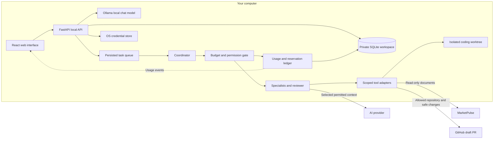
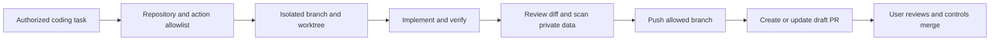

# Maestro architecture draft

Status: local chat is implemented with Ollama's native API and optional OpenAI-compatible providers. Real local generation, two-turn context, token accounting and persistent history are verified. Background reflection and agent execution are paused. The durable agent runner, automatic memory recall and GitHub/MarketPulse connectors remain planned.

## Interface and usage visibility

Keep the main screen focused on conversation and a short task list. A compact usage control stays in the header on every page and opens detailed usage plus budget settings without leaving the current work. The desktop sidebar offers Workspace, Tasks, Runs, Agents, Memory, Integrations, and Settings; mobile uses collapsible navigation.

The header shows real chat tokens and estimated API spend for today. Local Ollama reports tokens with zero provider API charges; hardware/electricity costs are excluded. The usage view shows input/output tokens, reservations and day/month totals. Users change spending and token limits locally. Per-agent usage and refinement/time controls remain planned. A planned Improvements view will show explanations and decisions for code-change proposals.

## System boundaries

The built frontend is served by the backend on one loopback origin. Ollama requests use loopback-only native endpoints, no credentials, local-model metadata checks and no cloud fallback. Optional API credentials are handled only by the backend and stored in Windows Credential Manager or server memory. User content and private configuration stay outside the public checkout. The coordinator and tool branches in this broader diagram remain planned.

### Background task process (planned)

Use a separate Maestro task process for queue consumption, coordination and eventual bounded review/revision. The browser and FastAPI process configure work and display persisted progress; closing the browser does not stop this task process. Ollama remains the shared inference server, with no second model daemon. Current local worker settings control context, CPU threads and model idle lifetime per chat request; they do not yet configure autonomous task execution.

Start with one explicitly queued text-only to-do, its own private task context and a saved result. Extract accounted generation from `Provider.chat()` so tasks and chat share one dispatch gate and ledger without sharing conversation history. Keep a single generation slot initially, giving chat priority between task steps. Persist queue claims, attempt ownership and worker leases, plus pause and cumulative token/call/time limits. Replace unconditional startup reservation recovery before another process can dispatch: an API restart must not release a live task worker's reservation, and late results from interrupted attempts must not overwrite a newer attempt. The first worker uses local Ollama only and has no integration or coding tools. Prove completion with the browser closed, pause, limit enforcement and recovery before adding iterative improvement.

## Current preview versus full runtime

### Optional hosted search (implemented)

The local chat adapter offers a single `web_search` tool when a verified search key and explicit automatic-search setting are present. A tool-capable local model chooses a query; the backend validates the single allowed call, contacts only `https://ollama.com/api/web_search`, and passes fitted, untrusted excerpts to one final generation with tools removed. Queries and actual source links persist privately beside the answer. Both local model calls share an output allowance and cumulative token gate. Known first-call usage remains recorded if search or final generation fails.

Search has a separate private attempt ledger and endpoint-scoped OS/session credential. Daily attempt caps, one in-flight search, five-second spacing, response-size limits and provider cooldowns apply to tests and chat. The single chat reservation remains active throughout planning/search/answer, preventing concurrent chat dispatch. Search does not fetch result pages, use provider inference credentials, enable cloud model inference or retry automatically. The public API exposes counts/readiness, never the key; search billing is unknown rather than included in zero local inference cost. Real local tool selection is proven using synthetic hosted results; an actual key test remains required to establish hosted access.

| Layer | Implemented preview | Next extension |
| --- | --- | --- |
| UI | React/TypeScript, responsive CSS, task/chat flow, run timelines, memory list, budget dialogs | Live streaming/status and per-agent usage drilldown |
| API | FastAPI, provider configuration, local session cookie, CSRF checks, origin/host validation | Modular routers and event stream |
| Storage | Private SQLite snapshot updated in an immediate transaction | Normalized records, migrations, job leases, granular events |
| Usage | Real chat tokens, zero-cost local calls, API price estimates, reservations and uncertain-charge reconciliation; demo data separate | Unified live-agent dispatch gate, tool fees, invoice import |
| Execution | Real chat; persistent to-do CRUD; agent execution paused | Durable planning, delegation, retries, cancellation |
| Memory | Manual records and user-reviewed reflection guidance | Scoped chat/task recall, baseline evaluations, promotion/rollback |
| Reflection | Retained prototype; worker and UI paused | Real task evidence, durable job leases, measured regression checks |
| Credentials | Native Windows storage or server memory for API keys; none used by local Ollama | Additional OS credential stores |
| Integrations | Descriptive GitHub/MarketPulse cards | Scoped, authorized tool execution |

The snapshot schema keeps this implementation small. The full runtime checks must be complete before automatic task-agent work is enabled.

### Retained reflection prototype (paused)

`backend/reflection.py` retains a private reflection-state record, feedback/job history and cost ledger. The current FastAPI lifespan disables reflection and starts no worker; the UI does not show its controls. The following describes retained prototype behavior, which is not active during local chat work.

Before each provider call, an immediate transaction reserves a conservative byte-based input estimate plus 1,024 output tokens, checking reflection and workspace limit settings. The network request runs outside the database lock. Response usage settles the reservation; missing usage/failed requests retain uncertain charges and pause dispatch. The two-minute limit blocks later dispatches rather than undoing an already issued call. Pricing is user-entered and cannot guarantee provider invoice amounts.

The OpenAI Responses request uses `store: false`, strict JSON output and no tool execution. Only explicitly provider-approved feedback and previously accepted reflection guidance enter its prompt. Reflector/reviewer are separate calls using the configured model; they are not independent objective evaluations. Six calls maximum, reviewer acceptance, unchanged-lesson detection, elapsed-time and resource checks bound the cycle. Drafts need user acceptance. Accepted guidance affects reflection only until scoped live-agent recall and regression-tested prompt promotion exist.

Restart marks running jobs interrupted and unresolved reservations uncertain, with no automatic replay of dispatched calls. Undispatched manually queued work remains eligible; pause blocks its first/next call. History clearing removes feedback/proposals/guidance while retaining accounting. The current launcher enforces a single local server; leases, normalized migrations and a production scheduler remain future work.

## Initial API contract

| Existing route | Purpose |
| --- | --- |
| `GET /health` | Identify the local preview without exposing workspace data. |
| `GET /api/session` | Establish an HttpOnly local session and obtain a CSRF token. |
| `GET /api/workspace` | Read private tasks, messages, runs, memory, limits, and demo usage. |
| `POST /api/tasks` | Save a task without calling a provider. |
| `PATCH /api/tasks/{id}` / `DELETE /api/tasks/{id}` | Complete/reopen or remove a task. |
| `POST /api/tasks/{id}/preview` | Create a simulated run; leave the real task open. |
| `POST /api/chat` / `DELETE /api/chat` | Real provider reply with usage/history; clear history while retaining accounting. |
| `GET /api/provider` / `PUT /api/provider` | Read/change private provider settings; key presence only, never key contents. |
| `POST /api/provider/test` | Fetch local installed models or an API model list without generation. |
| `DELETE /api/provider/key` | Remove the current API provider's saved credential. |
| `PUT /api/limits` | Validate and save local budget/execution limits. |
| `POST /api/memory` / `DELETE /api/memory/{id}` | Manually remember or forget private preview records. |
| `GET /api/reflection` / `PUT /api/reflection/config` | Status, private settings, limits, credential-presence flag and real usage. |
| `POST /api/reflection/feedback` / `POST /api/reflection/run` | Save feedback with explicit sharing consent; queue a bounded cycle. |
| `POST /api/reflection/jobs/{id}/review` | Keep or decline a proposed private lesson. |
| `DELETE /api/reflection/history` | Clear personal reflection content while retaining usage accounting. |
| `POST /api/reflection/charges/{id}/reconcile` | Confirm a provider-verified charge while paused. |

Workspace responses identify live chat separately from demo tasks/runs. Provider status exposes `credentials_required=false` for Ollama. GitHub execution remains disabled, and reflection's separate status is paused. The UI must not imply a task integration works before its capability is enabled.

Planned routes cover task run/cancel/resume, per-run usage, replayable `GET /api/events`, integration configuration, and PR preparation/submission. Credentials are never returned through read endpoints.

## Task and cost flow

1. Save the task and completion criteria. Manual tasks wait for Run; an authorized automation rule can queue eligible work.
2. Record a run snapshot and bounded specialist assignments.
3. Check permissions, cancellation, run limits, and daily/monthly allowances before each call/action. Reserve expected cost and tokens atomically.
4. Execute the request, persist observable events, and settle provider-reported usage. Keep uncertain charges reserved after timeouts.
5. Review the result and refine while criteria remain unmet, progress is possible, and limits permit another pass.
6. Keep a result or useful partial outcome and stop reason. Memory/evaluation work uses the same allowance.
7. Stream usage/status to the header and run view. Budget edits affect subsequent dispatches immediately; they do not undo charges already incurred.

The final ledger records provider/model, request/run/agent IDs, input/output tokens, relevant cache/reasoning breakdowns, tool fees, price version, reservations, and reconciliation status. Avoid counting usage twice. Distinguish estimates from invoices; calls outside Maestro are outside its accounting.

## GitHub collaboration

Maestro is allowed to submit PRs for user-assigned coding tasks within locally configured repository scope. This does not grant access to every repository or permission to merge.

Prefer a GitHub App installed only on selected repositories; a fine-grained token restricted to those repositories is an alternative. Store credentials in the OS credential store. Repository Contents write supports branches/changes, and Pull requests write supports PR creation. Grant additional capabilities only for an authorized feature. See the [GitHub PR API](https://docs.github.com/en/rest/pulls/pulls#create-a-pull-request), [reference API](https://docs.github.com/en/rest/git/refs#create-a-reference), and [installation-token scoping](https://docs.github.com/en/apps/creating-github-apps/authenticating-with-a-github-app/generating-an-installation-access-token-for-a-github-app).

Validate the remote, branch, allowed paths, tests, and complete diff before publication. Scan committed changes and PR text for secrets and private material. A draft PR contains the concrete behavior change and validation results; store its URL in private task history. Stable branch/action IDs make retries update the existing PR instead of opening duplicates.

GitHub tools receive code and public-safe task metadata, never unrestricted conversation or memory history. Keep private task context local. Workflow-file changes and other privileged paths require specifically enabled scope. Merging, permission changes, destructive operations, and deployment require separate authorization.

Assigned coding self-improvements can use this workflow. Prompt/memory improvements stay local and reversible; agents cannot automatically replace the running application. The current preview has no GitHub submission endpoint. This UI change is itself delivered as a draft PR through the development session's existing GitHub connection.

## Proposed code improvement pipeline

Planned: an observer can propose changes to Maestro's application code with motivation and explanation. The existing reflection worker only produces lessons; it does not implement this pipeline or hold coding/GitHub tools.

```mermaid
flowchart LR
    Evidence[Eligible outcomes and feedback] --> Proposal[Private proposal with rationale and criteria]
    Proposal --> Policy[User decision or configured draft policy]
    Policy --> Task[Bounded coding task]
    Task --> Worktree[Isolated candidate version]
    Worktree --> Evaluate[Baseline and regression checks]
    Evaluate -->|Focused revision within limits| Worktree
    Evaluate -->|Checks pass and public-safe diff| PR[Draft PR with explanation]
    PR --> Activate[User merge and activation decision]
    Activate --> Observe[Measure outcome on installed version]
    Observe -->|New evidence| Proposal
```

Store proposals, raw evidence, decisions and outcome records in private local storage. The proposal includes target/base commit, observed problem, expected behavior/benefit, likely components, measurable acceptance criteria, cost allowance, risks and rollback plan. Link it to a stable coding task and draft PR; replay cannot duplicate actions. Code-context sharing is explicitly scoped and public publication requires separate public-safe material.

The observer is an advisory component. A task broker applies the configured policy and existing repository authorization before coding tools become available. The coding worker operates in an isolated worktree; validation compares the reviewed candidate commit with its base and uses fixed acceptance criteria. Candidate code never runs inside the active orchestrator or receives its full credentials/private workspace for testing. Command/path permissions and credential/data isolation must be enforced by the runner; a worktree alone is not a sandbox.

The initial policy proposes changes for review; an opt-in automatic-draft policy can authorize preparation and PR submission within fixed scope and allowance. The agent may explain a need for broader scope, but cannot grant itself that scope or change spending controls. Merge and activation remain separate actions. Restart and migrations need their own tested recovery approach. Mark a proposal verified only when its recorded checks and post-activation measurements support the expected benefit.

First slice: proposal storage/API/UI and conversion of an approved proposal into one persisted to-do. This can precede the coding runtime. Later slices connect isolated execution, tests, PR publication and release/outcome tracking. The UI must report which stages actually work.

## Build sequence

1. **Visual preview:** inspect layout, task/chat flow, usage visibility, local limits, and responsive behavior without keys or charges.
2. **M1:** modular backend, migrations, secure provider settings, bounded live chat and streamed usage.
3. **M2-M3:** durable queue, specialist runner, cancellation, reservations, bounded review, and replayable events.
4. **M3a:** scoped coding worktrees and GitHub draft PR submission.
5. **M3b:** private code proposal inbox first; then evidence-backed patches, evaluations and tracked activation outcomes through M3a.
6. **M4-M5:** scoped memory recall/improvement and selected MarketPulse document access.

Detailed acceptance criteria are in [the development plan](../DEVELOPMENT_PLAN.md).
