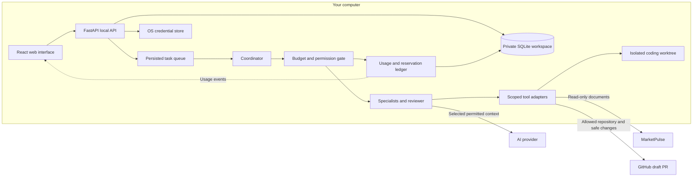
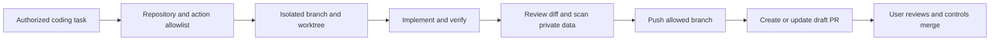

# Maestro architecture draft

Status: first implementation draft. The local UI preview is runnable; provider calls, the durable agent runner, automatic memory recall, and GitHub/MarketPulse connectors are still planned.

## Interface and usage visibility

Keep the main screen focused on conversation and a short task list. A compact usage control stays in the header on every page and opens detailed usage plus budget settings without leaving the current work. The desktop sidebar offers Workspace, Tasks, Runs, Agents, Memory, Integrations, and Settings; mobile uses collapsible navigation.

The header shows estimated spend and tokens for today. Its detail view will separate input/output tokens, reserved spend, settled estimates, daily/monthly totals, and per-run/agent usage. Users change spending, token, refinement, and time limits locally. The preview uses labelled synthetic usage; no sample amount represents a provider bill.

## System boundaries

The built frontend is served by the backend on one loopback origin. Credentials are handled only by the backend and provider/tool adapters. User content and private configuration stay outside the public checkout. Derived content inherits its sources' provider-sharing restrictions.

## Current preview versus full runtime

| Layer | Implemented preview | Next extension |
| --- | --- | --- |
| UI | React/TypeScript, responsive CSS, task/chat flow, run timelines, memory list, budget dialogs | Live streaming/status and per-agent usage drilldown |
| API | FastAPI, local session cookie, CSRF checks, origin/host validation | Modular routers, provider configuration, event stream |
| Storage | Private SQLite snapshot updated in an immediate transaction | Normalized records, migrations, job leases, granular events |
| Usage | Synthetic ledger; atomic demo spending/token checks | Provider usage, conservative reservations, fee reconciliation |
| Execution | Persisted tasks and explicitly simulated chat/run steps | Durable planning, delegation, retries, cancellation |
| Memory | Manually saved and removable records | Provenance, scoped recall, correction and inference review |
| Credentials | Key entry disabled | OS credential storage and session-only fallback |
| Integrations | Descriptive GitHub/MarketPulse cards | Scoped, authorized tool execution |

The snapshot schema keeps this first preview small. It is not the final agent database design. Refinement/time settings are saved for inspection; the finite simulation does not implement a live iterative runner. The full runtime checks must be complete before automatic paid work is enabled.

## Initial API contract

| Existing route | Purpose |
| --- | --- |
| `GET /health` | Identify the local preview without exposing workspace data. |
| `GET /api/session` | Establish an HttpOnly local session and obtain a CSRF token. |
| `GET /api/workspace` | Read private tasks, messages, runs, memory, limits, and demo usage. |
| `POST /api/tasks` | Save a task without calling a provider. |
| `PATCH /api/tasks/{id}` / `DELETE /api/tasks/{id}` | Complete/reopen or remove a task. |
| `POST /api/tasks/{id}/preview` | Create a simulated run; leave the real task open. |
| `POST /api/chat` | Save a message and an identified canned preview response. |
| `PUT /api/limits` | Validate and save local budget/execution limits. |
| `POST /api/memory` / `DELETE /api/memory/{id}` | Manually remember or forget private preview records. |

Responses expose capabilities explicitly: `mode=preview`, `live_ai=false`, `github_pr=false`, and `secure_credentials=false`. The UI must not imply an integration works before its capability is enabled.

Planned routes cover secure provider setup/status, task run/cancel/resume, per-run usage, replayable `GET /api/events`, integration configuration, and PR preparation/submission. Credentials are never returned through read endpoints.

## Task and cost flow

1. Save the task and completion criteria. Manual tasks wait for Run; an authorized automation rule can queue eligible work.
2. Record a run snapshot and bounded specialist assignments.
3. Check permissions, cancellation, run limits, and daily/monthly allowances before each call/action. Reserve expected cost and tokens atomically.
4. Execute the request, persist observable events, and settle provider-reported usage. Keep uncertain charges reserved after timeouts.
5. Review the result and refine while criteria remain unmet, progress is possible, and limits permit another pass.
6. Keep a result or useful partial outcome and stop reason. Memory/evaluation work uses the same allowance.
7. Stream usage/status to the header and run view. Budget edits affect subsequent dispatches immediately; they do not undo charges already incurred.

The final ledger records provider/model, request/run/agent IDs, input/output tokens, relevant cache/reasoning breakdowns, tool fees, price version, reservations, and reconciliation status. Avoid counting usage twice. Distinguish estimates from invoices; calls outside Maestro are outside its accounting.

## GitHub collaboration

Maestro is allowed to submit PRs for user-assigned coding tasks within locally configured repository scope. This does not grant access to every repository or permission to merge.

Prefer a GitHub App installed only on selected repositories; a fine-grained token restricted to those repositories is an alternative. Store credentials in the OS credential store. Repository Contents write supports branches/changes, and Pull requests write supports PR creation. Grant additional capabilities only for an authorized feature. See the [GitHub PR API](https://docs.github.com/en/rest/pulls/pulls#create-a-pull-request), [reference API](https://docs.github.com/en/rest/git/refs#create-a-reference), and [installation-token scoping](https://docs.github.com/en/apps/creating-github-apps/authenticating-with-a-github-app/generating-an-installation-access-token-for-a-github-app).

Validate the remote, branch, allowed paths, tests, and complete diff before publication. Scan committed changes and PR text for secrets and private material. A draft PR contains the concrete behavior change and validation results; store its URL in private task history. Stable branch/action IDs make retries update the existing PR instead of opening duplicates.

GitHub tools receive code and public-safe task metadata, never unrestricted conversation or memory history. Keep private task context local. Workflow-file changes and other privileged paths require specifically enabled scope. Merging, permission changes, destructive operations, and deployment require separate authorization.

Assigned coding self-improvements can use this workflow. Prompt/memory improvements stay local and reversible; agents cannot automatically replace the running application. The current preview has no GitHub submission endpoint. This UI change is itself delivered as a draft PR through the development session's existing GitHub connection.

## Build sequence

1. **Visual preview:** inspect layout, task/chat flow, usage visibility, local limits, and responsive behavior without keys or charges.
2. **M1:** modular backend, migrations, secure provider settings, bounded live chat and streamed usage.
3. **M2-M3:** durable queue, specialist runner, cancellation, reservations, bounded review, and replayable events.
4. **M3a:** scoped coding worktrees and GitHub draft PR submission.
5. **M4-M5:** scoped memory recall/improvement and selected MarketPulse document access.

Detailed acceptance criteria are in [the development plan](../DEVELOPMENT_PLAN.md).
