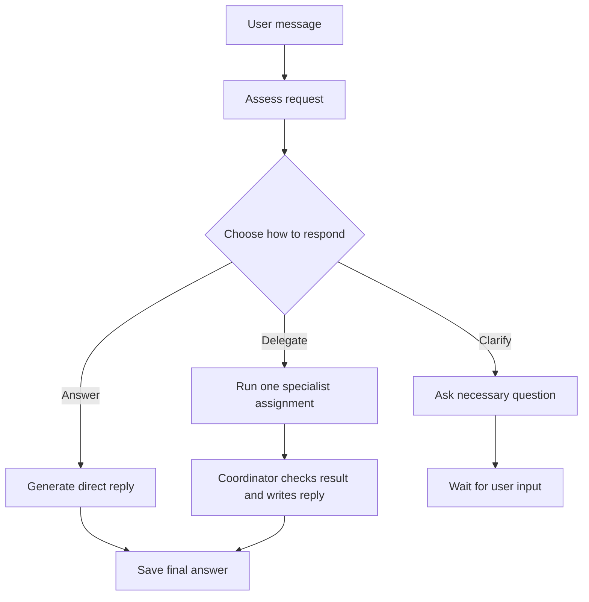

# Chat assessment and delegation

Design updated 2026-10-04. Local coordinator-model selection is implemented. The separate assessment, durable progress and specialist workflow below remain proposed.

Each user message should first reach a coordinator that assesses the request and chooses how to handle it. The coordinator can answer directly, ask a necessary clarification, or assign a bounded task to an available specialist. The user sees useful progress as work happens and receives one coherent answer in the original conversation.

The first implementation should use local Ollama, one specialist at most, and sequential inference. Reuse Maestro's generation and accounting service, private storage, and saved model choices. Add the workflow in small increments without an agent framework or a growing tree of workers.

## Current behavior

The chat UI submits `role: chat` to `POST /api/chat`, which waits for `Provider.chat` to finish. Local **Chat routing** chooses the normal chat model or configured installed orchestrator model, with chat-model fallback for a blank orchestrator choice. An explicit per-message model overrides that route. Existing configurations default to `direct`; `orchestrator` applies to local Ollama only. The reply and ledger record the actual selected model.

The selected model receives conversation context and optional private memory, chooses whether to use the available source tool and writes the answer. Web search or saved-source lookup uses at most one tool round and two answer calls sharing the existing output allowance and generation slot. Local follow-ups can receive bounded server-authored prior-source evidence without another hosted search. Model selection does not add a separate typed assessment call or a worker handoff. The browser reveals the completed reply progressively; provider streaming and durable live stage events remain planned.

Background reflection has its own fixed formation and review workflow. It can create attributed to-dos, but those records do not execute. The coordinator route is a synchronous chat option; general delegation is unavailable. See the [architecture](ARCHITECTURE.md) and [development plan](../DEVELOPMENT_PLAN.md).

## Proposed user experience

Submitting a message starts a run attached to that message. A compact status area appears beneath it and updates when the server records a change. The final answer takes its usual place in the conversation; completed progress can be expanded afterward.

An ordinary question might show “Considering your request” followed by “Writing a reply.” A comparison that benefits from a specialist might show “Considering your request,” “Asking the analysis specialist to compare these options,” and “Checking the comparison and writing a reply.” These transitions appear only when their corresponding work starts.

| Status | When it appears |
| --- | --- |
| Waiting for the local model | The run is queued behind another inference call. |
| Loading the selected model | The runtime begins loading or switching models, when that operation can be observed. |
| Considering your request | The coordinator's assessment call starts. |
| Asking the analysis specialist to compare these options | A validated specialist assignment starts; the wording identifies the actual assignment. |
| Searching the web | An enabled search tool is actually dispatched. |
| Checking the result and writing a reply | The coordinator starts the combined check-and-reply call on a saved specialist result. |
| Writing a reply | Final answer generation starts. |
| Waiting for your reply | A clarification question has been saved. |
| Stopped or interrupted | The run ends or pauses with a concrete reason and any useful saved progress. |

Use concise stage descriptions and brief task summaries. Keep internal reasoning private. Do not reveal hidden deliberation, raw prompts, or invented agent conversations. An assignment summary can be based on validated structured output; authoritative stage changes come from the runtime. Show elapsed time for long waits, without an invented percentage or estimated completion time.

The user can stop a run, close the browser, switch conversations, or reconnect. Stop prevents further dispatches immediately; show “Stopping” while an already dispatched provider call is still unresolved. Keep the generation slot reserved until that inference completes or is confirmed stopped. Reconnecting restores the saved state. A stopped or failed run can return a useful partial result, clearly identifying what remains incomplete.

## Assessment and route selection

Every accepted message starts with a short, bounded assessment call. Its input contains the new message, relevant recent conversation, selected private memory, and an accurate list of available capabilities. The coordinator returns a validated decision using one of three routes:

| Route | Use it when | Required output |
| --- | --- | --- |
| Answer | The selected chat model can address the request with its available context and tools. | The reply objective and any permitted tool need. |
| Clarify | Missing information prevents a useful or authorized next step. | One focused question identifying the missing input. |
| Delegate | A specific available specialist can do a useful, bounded part of the request. | Specialist role, assignment, selected context references, completion criteria, and requested allowance. |

Prefer direct answers for ordinary conversation, explanations, and simple edits. Clarify only when the missing information materially affects the work. Delegation should have a concrete benefit, such as comparing several supplied options or reviewing a draft against stated criteria. It must refer to an executable capability, not a role invented by the model.

Use a small typed decision, not a free-form plan or a numerical confidence threshold. The backend checks the route, capabilities, model availability, context permissions, and remaining allowance before acting. User-provided text and retrieved content cannot add capabilities or increase allowances. An unavailable or malformed delegation decision never launches work: answer directly if that still satisfies the request, otherwise explain the missing capability. Record the failed assessment and its usage; do not retry indefinitely.

The planned assessment must receive enough context to choose a route without repeatedly reprocessing the entire history. Start with the model selected by the current direct/orchestrator setting or per-message override for both assessment and replies, avoiding unnecessary switches. A later increment may separate assessment and answer models when measurements justify it. Capture these choices on the run; specialist choices become visible in its progress details.

This adds an inference call before an ordinary answer. Measure the latency and routing benefit before choosing a different default model or raising the assessment allowance. The assessment, reply, optional search, and title all consume the same run allowance and usage ledger. Reserve enough of the allowance for a final answer before starting a child.

## First specialist workflow

Begin with one local specialist that performs text analysis or drafting from supplied context. A subagent is a separate model invocation with its own assignment and context; it does not require another simultaneously loaded model or another application container.

The coordinator creates a durable child attempt containing the task objective, allowed context, selected installed model, completion criteria, and limits. The specialist receives only that material and returns a saved result with any missing evidence or unmet criteria. It cannot delegate further. Shell access, repository changes, document retrieval, and external actions require their own implemented and configured capabilities.

The coordinator checks the result against the criteria and produces the user-facing answer. Check objective evidence where available, such as requested items being covered or calculations agreeing with inputs. Model agreement alone does not establish correctness. The final answer remains explicit about missing evidence and incomplete work.

The initial paths need one assessment call plus one reply call for a direct answer, or one assessment call, one specialist call, and one coordinator check-and-reply call for delegated work. A clarification can use the validated question from assessment without another generation call. Search and optional titles must fit within the captured limits. Add a single specialist revision only in a later increment with its own acceptance criteria and a shared allowance for all additional calls.

An execution run and a task-list to-do are separate concepts. Chat delegation creates linked run records without filling the task list with internal steps. A deliberately saved follow-up can become a to-do with the existing initiator and suggested-worker fields. Background task suggestions continue to require explicit execution policy before they run.

## Runtime and recovery

Persist the submitted message and run before inference. Record a stable submission identity, conversation/message IDs, captured model and capability settings, route, parent/child links, attempts, results, progress events, and remaining allowances. Relevant context records carry their source IDs and revisions. Revalidate permission and deletion barriers before dispatch or saving a derived result.

Run context, specialist results, and status summaries are private workspace data. Deleting a conversation cancels or fences dependent attempts and removes their saved content under the existing conversation-deletion rules, while retaining usage accounting. Forgetting a memory invalidates pending dependent work and prevents future recall; it does not erase earlier conversation messages or backups. Late worker responses cannot recreate deleted content.

The runtime owns transitions between queued, assessing, executing, composing, waiting for input, and terminal states. Each attempt has an owner and a lease so that restart recovery can distinguish abandoned work from a live worker. Commit results only for the current attempt. Repeated submission, reconnect, or an API restart must not create a duplicate user message, child dispatch, or final reply.

Reuse the shared generation service and ledger rather than duplicating provider dispatch. Extend its explicit-context contract for chat assessment and specialist attempts: the current `generate_context` validation only supports existing local reflection, memory, and coding roles, with structured schemas/deadlines tied to reflection jobs. The existing API restart recovery also assumes it owns every generation call. Both contracts need an intentional ownership-aware extension before a separate worker can dispatch safely.

Keep one active local inference call across chat, specialists, reflection, search follow-up, and titles. Foreground runs take precedence between calls; background reflection yields until they finish. A foreground request does not unload or interrupt an active background model unexpectedly. Configure bounded context and output for each role, switch models sequentially, and verify release before loading the next model. These limits govern Maestro's own calls; other Ollama clients and desktop applications can still consume GPU resources.

All child attempts inherit the parent's remaining call, token, time, spend, and tool allowance. They cannot enlarge it. Context scope is explicit: local-only memory and derived text cannot enter a remote profile or hosted search. Capture settings for the run and recheck that its actions remain permitted after configuration changes. Preserve settled usage and unresolved dispatches when cancelling or recovering; an uncertain provider call must not be duplicated automatically.

Publish persisted, ordered status events linked to the run. A proposed API returns a run ID promptly, provides a read endpoint for current state, and offers an authenticated server-sent event stream that can resume after the last event ID. Reuse local session checks, validate Origin on reads, and require CSRF protection for creation and cancellation. Implement snapshot polling first if it makes the initial increment smaller; the persistence and ordering contract is the same. Browser disconnect never cancels work by itself. Provider token streaming is a separate enhancement.

## Implementation increments

| Increment | Deliverable | Acceptance |
| --- | --- | --- |
| CHAT-01 Observable chat runs | Persisted runs, ordered runtime events, reconnect and stop behavior around the existing direct reply path. | A real reply continues with the browser closed. Reopening restores progress and one saved answer. Cancellation, duplicate submission, and restart preserve usage and prevent duplicate results. |
| CHAT-02 Assessment before answering | Typed assessment, direct and clarification routes, and capability-aware rejection of unavailable delegation. | Simple requests answer with two bounded calls. Necessary clarification uses one call. Invalid decisions, unavailable capabilities, and exhausted allowances stop safely with truthful status. No specialist status appears before execution exists. |
| CHAT-03 One local specialist | Durable parent/child execution and coordinator synthesis after the [task ownership foundation](../DEVELOPMENT_PLAN.md#2-complete-one-durable-task). Reuse validated local model choices initially. | A chat request uses one specialist with selected context and visible attribution, then returns one final reply. Restart cannot duplicate the child; cancellation blocks subsequent calls; reflection and chat share one slot. |
| CHAT-04 Broader routing and bounded revision | Named profiles and scoped integrations as needed, plus at most one justified specialist revision within the parent's limits. | Distinct assignments use explicitly configured capabilities and sharing permissions. A failed criterion can trigger one useful revision; no progress, missing evidence, cancellation, and exhausted limits produce a clear stop. |

Use synthetic providers for state, event ordering, duplicate submission, context scope, cancellation, and restart tests. Add browser coverage for reconnect, conversation switching, accessible status updates, and final replies replacing active progress. Run a bounded local trial to measure direct-answer overhead, route quality, specialist usefulness, model-switch latency, and peak RAM/VRAM. Compare results against today's direct chat path before enabling delegation by default.

The first product milestone is an observable chat that actually assesses input and answers or asks a useful question. The next is one real specialist assignment that returns a reviewed result to that same chat. Broader autonomy follows evidence that these small paths work.
