# Private memory and background reflection

Updated: 2026-10-03. This branch implements explicit memory, shared local generation and an opt-in durable reflection worker. Inferred memories remain proposals until the user accepts them. Automatic promotion and task execution remain planned.

## Working first increment

Settings provides **save, edit and forget** for explicit facts or preferences. `backend/memory.py` stores them in the existing private SQLite database, in a new `private_memories` table. No additional service, container, dependency or model call is needed to manage or retrieve memory. Prototype archive records stay inactive.

Records have an ID, content, workspace/conversation scope, optional chat/user-message provenance, explicit origin and timestamps. Conversation records require an existing chat. Source-linked records require a real user message; assistant claims cannot serve as their source. Workspace records without a chat reference survive chat deletion. Deleting a chat removes scoped and source-linked memories in the same transaction.

Recall uses Unicode word overlap with basic English/Swedish stopwords. It selects relevant workspace/current-conversation records within saved count/character allowances, capped at five records and 1,000 combined characters. Setting either allowance to zero disables recall without deleting memory. The store permits 200 records of 1,000 characters each. Lowest-ranked records are omitted when they cannot fit context/token limits. Keyword recall can miss paraphrases; measure misses before adding FTS or embeddings.

Only normal local Ollama chat receives memory, when automatic hosted search is inactive. Memory enters the prompt as quoted, untrusted supplemental data; it grants no tools or permissions. Current user instructions take precedence. The reply records supplied memory IDs and the UI displays their count; this identifies context supplied, not proof the model used every entry.

Memory-derived history also remains local: conversations containing these IDs cannot subsequently dispatch to a remote provider or active hosted search. Start a new conversation for those modes. Titles use a bounded first user message; explicit reflection context receives no automatic recall. Forgetting retains historical IDs so provider switching cannot bypass this restriction.

`POST /api/memory`, `PATCH /api/memory/{id}` and `DELETE /api/memory/{id}` mutate records; `GET /api/memory` and workspace snapshots expose them for management. Session, Origin and CSRF checks apply. Validation errors do not echo input. Known active provider/search credentials are rejected if pasted into memory; this is not a general secret detector.

Editing replaces a record for future recall. Separate contradictory records are not merged: correct or forget the old record. Forget removes the live row with SQLite secure deletion enabled, but cannot retract a dispatched prompt or erase earlier replies, snapshots or backups. Source text editing is unsupported; versioning must precede it. Reads exclude missing, empty or non-user sources without modifying the database.

`Provider.generate_context(instructions, messages, model, max_output_tokens, kind)` accepts explicit local-only reflection, memory-extraction or coding context through existing dispatch, limits, reservation and accounting. It captures configuration, validates an installed completion model, disables tools/search/chat persistence and forces `keep_alive=0`. Reflection/memory outputs use the saved cap (default 512); explicit requests and provider limits can reduce it. Coding uses the request/provider cap, with a 1,024-token ceiling for this text-only foundation. A caller must initialize the workspace first. This does not execute coding tools or queue work.

## Saved configuration

**Settings → Task models & reflection** saves private `work_config` alongside the workspace in SQLite. `GET/PUT /api/work-config` exposes this validated configuration; defaults on existing workspaces require no migration/write. Chat and orchestrator choices remain in provider settings. Task choices survive changing the chat provider, but dispatch requires the current connection to be Local Ollama; no remote fallback is permitted.

For each task kind, an explicit per-call model wins, then the saved model, then the recommended installed tag, then the local chat default. Blank selections mean recommended installed model: `gpt-oss:20b` for reflection, `qwen2.5:7b` for extraction, `devstral-small-2:24b` for coding. Recommendations use the discovered installed list, and every dispatch verifies model capability. Explicit missing tags fail with an actionable error; the system does not silently replace them or download models.

| Setting | Default | Current effect |
| --- | --- | --- |
| Reflection/memory/coding model | Recommended installed tag or chat fallback | Selected for explicit-context generation of that kind. |
| Reflection output tokens | 512 | Caps reflection and memory-extraction output alongside provider/request limits. |
| Memories per reply / context characters | 5 / 1,000 | Bounds local recall; either zero disables it. |
| Debounce / chat idle time | 60 / 30 seconds | Coalesces new user evidence and waits for chat to become idle. |
| Daily reflection jobs / total tokens | 10 / 10,000 | Reserved conservatively before dispatch; zero pauses dispatch. |
| Job timeout | 180 seconds | One deadline covers model verification and inference. Unconfirmed completion keeps the generation gate blocked until Ollama reports no loaded models. |
| Background reflection enabled | False | Explicitly enable with a configured local Ollama connection; pause prevents new dispatch and discards late results. |

One shared generation slot and post-task model unloading are fixed safety boundaries. Local context size, CPU threads and chat keep-loaded duration remain in **Model connection → Local worker settings**. Coding and standalone extraction model choices are saved for their respective explicit callers; the idle worker makes one reflection call using the reflection model. [Windows background operation](WINDOWS_BACKGROUND.md) explains locking, sleep and launcher lifetime.

## Using background reflection

1. Select a local Ollama connection in Settings.
2. In **Task models & reflection**, choose a reflection model, enable background reflection and save.
3. Continue a local chat. New user messages are queued atomically with successful replies; old chats are not scanned when enabling the worker. Hosted-search turns are excluded.
4. After the configured debounce and chat inactivity, one bounded call can propose up to three exact excerpts of user evidence. With no eligible evidence, the worker waits without making model calls.
5. Inspect the proposals in **Private memory**. Accept one for its conversation or all local chats, or reject it. Proposals are excluded from recall until accepted; accepted records support the existing edit/forget controls.

Settings shows queued/running work, daily usage and the latest stop reason. Closing the browser does not stop the server-side worker. Locking Windows also permits work while the computer stays awake. The application and Ollama must remain running; automatic startup after a reboot is not installed.

## Implemented background path

Reflection turns selected user evidence into memory proposals, with no inference when there is no new evidence. [Reflexion](https://arxiv.org/abs/2303.11366) supports feedback-driven textual memory; its results do not establish arbitrary self-criticism as reliable for Maestro. [LangChain's memory concepts](https://docs.langchain.com/oss/python/concepts/memory) distinguish conversation state, persistent memory and background updates; these ideas do not require adopting its framework.

```mermaid
flowchart LR
    Event[New eligible local user message] --> Tx[Commit message and coalesced job]
    Tx --> DB[(Existing private SQLite)]
    DB --> Worker[One worker in API lifespan]
    Worker --> Gate[Shared reservation and ledger]
    Gate --> Ollama[Selected installed local model]
    Ollama --> Validate[Validate evidence, scope and source hashes]
    Validate --> Candidate[Private memory proposal]
    Candidate --> Review[User accepts or corrects]
    Review --> Recall[Bounded local recall]
```

One worker starts inside FastAPI's lifespan under exclusive workspace ownership, in the application container. Synchronous job processing runs off the API event loop. The worker waits cheaply with the browser closed and requests model unloading after each eligible job. Shutdown waits for in-flight processing to finish or reach its deadline.

Jobs persist atomically with successful local chat exchanges and coalesce by conversation checkpoint. The worker receives only bounded real user messages, never its own prose or assistant claims. Each job permits one tool-free call. Explicit feedback APIs and verified task outcomes can supply evidence in later increments.

A batch holds at most eight source references and 6,000 source characters, reduced further to fit the configured context allowance including instructions/schema and the conservative token reserve. Long messages contribute a prefix; the default 4,096-token context can leave only a short excerpt. Reflection can miss preferences later in a long message. Increasing local context permits more evidence; full-history extraction and quality evaluation remain separate work.

`reflection_jobs` stores source IDs/hashes, state, attempt token, captured settings, ledger request ID, timestamps and stop reason. Source text remains in the original chat. Separate candidate records hold pending excerpts and retain fingerprints after acceptance/rejection; resolved proposal text is cleared. Checkpoints prevent retrospective enqueue, and invalidation epochs prevent stale results from reappearing after edits, forgetting or configuration changes.

The installed reflection model is selected independently of chat while sharing one generation slot. New chat activity delays dispatch between jobs. Defaults are 60-second debounce, 30 seconds of inactivity, one dispatch per job, 512 output tokens, ten jobs and 10,000 total input/output tokens daily. Worst-case usage is reserved before dispatch. These defaults need further measurements; dollar limits cannot bound free local inference. An already running job may briefly delay chat; instant preemption is not implemented.

Local capability, settings, source hashes and ownership are rechecked before dispatch and commit. Startup preserves queued jobs, safely abandons interrupted dispatched jobs and prevents automatic replay. Attempt tokens prevent stale commits. Model/provider changes never create remote fallback. An overdue request is closed; ambiguous completion retains the generation reservation until `/api/ps` reports no loaded models. Requiring an empty list avoids alias-dependent cancellation checks; another application's loaded model may prolong this conservative wait. Maestro does not forcibly unload other applications' models. Separate processes still require leases and ownership-aware recovery before dispatch.

The response uses [Ollama structured output](https://docs.ollama.com/capabilities/structured-outputs), then deterministic validation checks strict JSON, source IDs, exact evidence excerpts, duplicates and credential-looking content. A supported source quote does not justify an invented paraphrase: candidate content must itself appear in the quoted evidence. Source deletion cancels dependent jobs and removes proposals and source-linked accepted memories. Editing or forgetting memory conservatively invalidates pending work/proposals. Rejected fingerprints remain rejected across reprocessing.

Only user acceptance promotes a candidate into explicit scoped memory, with its source provenance preserved. Automatic promotion requires a future evaluation and narrowly defined rule. [MINJA](https://arxiv.org/abs/2503.03704) demonstrates why memory writes require controls beyond trusting an extraction model. Memory inherits local-only restrictions and never overrides instructions or permissions.

## Recorded next tasks

| ID | Increment | Acceptance |
| --- | --- | --- |
| MEM-01 | Explicit memory/local recall — implemented | Save/edit/forget persists; scopes, credential rejection and chat deletion pass API/browser checks. |
| GEN-01 | Explicit-context generation — implemented | Local calls share reservation/accounting, leave chats unchanged and use no tools/search/recall. |
| REF-01 | Durable chat jobs and source hashes — implemented | Atomic enqueue, deduplication, correction/forget/delete invalidation and stale-attempt rejection survive restart. |
| REF-02 | Idle worker and independent model choice — implemented | Browser-independent work, inactivity priority, pause/disable, one slot, config changes, call/token/time bounds and unload checks. |
| REF-03 | Evidence-backed candidates — implemented | Strict schema, exact user excerpts, credential rejection, provenance and explicit user acceptance. |
| REF-04 | Evaluate/selectively promote | Compare no-memory/explicit/candidate-assisted behavior; measure usefulness, false/stale facts, abstention, latency and memory use. |

Use synthetic fixtures in CI, including deletion during inference, restart after dispatch and provider switching. [LongMemEval](https://arxiv.org/abs/2410.10813) motivates testing updates, temporal evidence and abstention alongside extraction. A small passing probe cannot validate autonomous curation. See [LOCAL_MODELS.md](LOCAL_MODELS.md) for current measurements.
