# Private memory and background reflection

Design date: 2026-10-02. Explicit memory and shared local generation are implemented on this branch. Durable background reflection is the next increment; no reflection loop or automatic extraction runs yet.

## Working first increment

Settings provides **save, edit and forget** for explicit facts or preferences. `backend/memory.py` stores them in the existing private SQLite database, in a new `private_memories` table. No additional service, container, dependency or model call is needed to manage or retrieve memory. Prototype archive records stay inactive.

Records have an ID, content, workspace/conversation scope, optional chat/user-message provenance, explicit origin and timestamps. Conversation records require an existing chat. Source-linked records require a real user message; assistant claims cannot serve as their source. Workspace records without a chat reference survive chat deletion. Deleting a chat removes scoped and source-linked memories in the same transaction.

Recall uses Unicode word overlap with basic English/Swedish stopwords. It selects at most five relevant records with 1,000 combined characters, from workspace memory and the requested conversation. The store permits 200 records of 1,000 characters each. Lowest-ranked records are omitted when they cannot fit context/token limits. Keyword recall can miss paraphrases; measure those misses before adding FTS or embeddings.

Only normal local Ollama chat receives memory, when automatic hosted search is inactive. Memory enters the prompt as quoted, untrusted supplemental data; it grants no tools or permissions. Current user instructions take precedence. The reply records supplied memory IDs and the UI displays their count; this identifies context supplied, not proof the model used every entry.

Memory-derived history also remains local: conversations containing these IDs cannot subsequently dispatch to a remote provider or active hosted search. Start a new conversation for those modes. Titles use a bounded first user message; explicit reflection context receives no automatic recall. Forgetting retains historical IDs so provider switching cannot bypass this restriction.

`POST /api/memory`, `PATCH /api/memory/{id}` and `DELETE /api/memory/{id}` mutate records; `GET /api/memory` and workspace snapshots expose them for management. Session, Origin and CSRF checks apply. Validation errors do not echo input. Known active provider/search credentials are rejected if pasted into memory; this is not a general secret detector.

Editing replaces a record for future recall. Separate contradictory records are not merged: correct or forget the old record. Forget removes the live row with SQLite secure deletion enabled, but cannot retract a dispatched prompt or erase earlier replies, snapshots or backups. Source text editing is unsupported; versioning must precede it. Reads exclude missing, empty or non-user sources without modifying the database.

`Provider.generate_context(instructions, messages, model, max_output_tokens)` accepts explicit local-only context through the existing dispatch, limits, reservation gate and accounting. It captures configuration, validates an installed completion model, disables tools/search/chat persistence and forces `keep_alive=0`. Output defaults to 512 tokens, capped by requested/configured limits. It adds no worker, queue or independently configured reflection model yet. A caller must initialize the workspace before calling it.

## Intended background path

Reflection should turn useful evidence into proposed memories or lessons, with no inference when there is no new evidence. [Reflexion](https://arxiv.org/abs/2303.11366) supports feedback-driven textual memory; its results do not establish arbitrary self-criticism as reliable for Maestro. [LangChain's memory concepts](https://docs.langchain.com/oss/python/concepts/memory) distinguish conversation state, persistent memory and background updates; these ideas do not require adopting its framework.

```mermaid
flowchart LR
    Event[User correction or observed outcome] --> Tx[Commit event and deduplicated job]
    Tx --> DB[(Existing private SQLite)]
    DB --> Worker[One worker in API lifespan]
    Worker --> Gate[Shared reservation and ledger]
    Gate --> Ollama[Selected installed local model]
    Ollama --> Validate[Validate evidence, scope and source versions]
    Validate --> Candidate[Private candidate memory or lesson]
    Candidate --> Review[User accepts or corrects]
    Review --> Recall[Bounded local recall]
```

Start one worker inside FastAPI's lifespan under exclusive workspace ownership. Keep it in the application container; no separate worker container or Redis is needed. Offload synchronous inference from the API event loop. The worker waits cheaply with the browser closed, but the application must remain running. Unload the model after each eligible job.

Persist a job atomically with explicit correction/feedback, a debounced conversation batch or a future verified task outcome. Coalesce events by conversation checkpoint; never enqueue from the worker's own prose. Begin with one tool-free call per job and a bounded source batch. An AI answer or confidence score is not verified evidence.

Add `reflection_jobs` with unique event/checkpoint identity, source references/versions, queued/running/done/failed/cancelled state, attempt token, model/config snapshot, ledger request ID, timestamps and stop reason. Store references rather than unnecessary source copies. Extend memory with candidate/active/rejected status and fact/preference/lesson kind when these states have working behavior.

Select an installed reflection model independently of chat while sharing one generation slot. Give chat priority between jobs. Provisional defaults: 60-second debounce, 30 seconds of chat inactivity, one dispatch per job, 512 output tokens, ten jobs and 10,000 total input/output tokens daily. Reserve worst-case usage before dispatch. These defaults need measurements; dollar limits cannot bound free local inference. An already running job may briefly delay chat; instant preemption is not implemented.

Recheck local capability/configuration before dispatch; model/provider changes never create remote fallback. Recover unfinished local jobs/reservations at startup under the sole owner. Attempt tokens prevent stale commits. Separate processes require leases and ownership-aware recovery before dispatch is enabled. Timeouts stop further work and retain ownership until inference completion/cancellation is established; an HTTP timeout alone does not stop an Ollama runner.

Validate bounded JSON, supporting evidence, scope, duplicates and explicit corrections. Recheck source existence/version, claim ownership and budget in the result transaction. Source deletion cancels dependent jobs and removes derived records/indexes; late responses cannot recreate them. Tombstones/version checks must also prevent resurrection after forgetting/editing. Rejected proposals remain rejected across reprocessing.

Keep inferred entries as inspectable candidates initially. Promote only after user acceptance or a measured, narrowly defined rule. [MINJA](https://arxiv.org/abs/2503.03704) demonstrates why memory writes require controls beyond trusting an extraction model. Derived summaries/lessons inherit provenance and local-only restrictions. Memory never overrides instructions or permissions.

## Recorded next tasks

| ID | Increment | Acceptance |
| --- | --- | --- |
| MEM-01 | Explicit memory/local recall — implemented | Save/edit/forget persists; scopes, credential rejection and chat deletion pass API/browser checks. |
| GEN-01 | Explicit-context generation — implemented | Local calls share reservation/accounting, leave chats unchanged and use no tools/search/recall. |
| REF-01 | Durable events/jobs and source versions | Atomic enqueue, deduplication, correction/forget/delete invalidation and stale-attempt rejection survive restart. |
| REF-02 | Idle worker and independent model choice | Browser-closed work, chat priority, pause/disable, one slot, config changes, call/token/time bounds and unload verified. |
| REF-03 | Evidence-backed candidates | Strict schema/sources/correction precedence; injection, unsupported claims and secrets cannot become active memory. |
| REF-04 | Evaluate/selectively promote | Compare no-memory/explicit/candidate-assisted behavior; measure usefulness, false/stale facts, abstention, latency and memory use. |

Use synthetic fixtures in CI, including deletion during inference, restart after dispatch and provider switching. [LongMemEval](https://arxiv.org/abs/2410.10813) motivates testing updates, temporal evidence and abstention alongside extraction. A small passing probe cannot validate autonomous curation. See [LOCAL_MODELS.md](LOCAL_MODELS.md) for current measurements.
