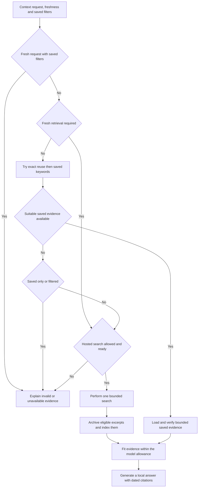

# Search context storage

Design and delivery sequence, 2026-10-04. Store reusable public source material in a configured directory such as `C:\Users\malme\OneDrive\maestro\web-context`, preserve the version used for an answer, and show when that evidence was obtained. The implementation provides eligible-public or approved-URL excerpt capture, immutable repeated observations, exact-query reuse, keyword retrieval with domain/retrieval-date filters, source modes and dated saved-source viewing. Full downloads and publisher-date extraction follow later. The preview mounts the dedicated directory, has a tested hosted search connection and now enables `all_public` capture with 10 GiB, 200,000 files/directories and a 24-hour reuse window. Other installations need their own deployment and setup.

Use OneDrive for source files and portable metadata. Keep the live SQLite index, chat associations and query history in Maestro's existing private local storage. The delivery saves the search excerpts Maestro already receives; full source downloads remain a separate increment.

## Current behavior and verified setup

[`backend/web_search.py`](../backend/web_search.py) calls the fixed hosted Ollama search endpoint, validates public links and credentials, and retains at most 1,200 characters per result before additional prompt fitting. With archiving disabled, [`backend/provider.py`](../backend/provider.py) retains the earlier links-only behavior. With archiving enabled, [`backend/context_store.py`](../backend/context_store.py) saves eligible excerpts before final generation and the provider binds fitted evidence, content/manifest hashes and retrieval dates to the answer. A failed answer can still leave reusable captures. Earlier links-only answers cannot be converted into historical snapshots from their links alone.

Online search readiness and source saving are separate. Search can succeed while saving is off, unavailable or excludes returned URLs; those citations remain unarchived. Enabling saving applies to future eligible search results and does not fill earlier citations retrospectively. A connection test always makes its fixed public hosted query and consumes allowance; eligible test results are captured only when saving is enabled under `all_public`. Tests do not fill the archive under `approved_sources`. Saved objects contain dated excerpts, not full downloaded pages. The earlier preview weather search saved two approved excerpts and their manifests in OneDrive; local keyword lookup and hash-bound readback reused that evidence without another hosted request. An HTTP-only result remained unarchived under that approved-HTTPS policy.

Fresh configurations default to `capture_policy: all_public`, `enabled: false`, a 24-hour reuse window, 10 GiB and 200,000 files and directories. A configured mount alone grants no capture permission. Enabling **Save eligible public search results** authorizes saving eligible returned snippets without a per-site list. **Only approved URLs** remains available for restricted HTTPS collections. Persisted older configurations, or legacy API bodies omitting the policy, keep `approved_sources` and their existing limits; upgrading does not widen a collection automatically. Byte and item caps are configurable, with supported maxima of 100 GiB and 200,000 items. Reaching a cap stops additional capture without removing existing records. Automatic pruning is not implemented.

The Settings view distinguishes indexed source snapshots from measured archive bytes and file/directory counts. The compact globe menu separates online readiness, saving status and source counters. Status measurements update on enabled configuration, capture, deletion and rebuild; they are not continuous filesystem polling. File totals include manifests, objects, format/claim files and staging artifacts; directories count toward the item cap but contribute no file bytes. The private index and query database are excluded.

`last_capture` describes the most recent bounded acquisition attempt, or is null before one is measured. It contains no query or private conversation text:

| Field | Meaning |
| --- | --- |
| `retrieved_at` | The original acquisition timestamp, not the time a saved result was reused. |
| `sources_received` | Number of returned entries considered within the configured one-to-three result allowance. |
| `sources_saved` | Entries whose immutable manifests and index rows were successfully published. |
| `excerpt_bytes` | UTF-8 bytes in those saved excerpts, including repeated excerpts that share an object. |
| `object_bytes` | Bytes in object files newly published by this attempt; deduplicated objects add zero. |
| `manifest_bytes` | Bytes in capture manifests newly published by this attempt. |
| `new_bytes` | Newly published object plus manifest bytes, including files published before a later indexing failure; excludes directories, format/claim files and private databases. |

Saved counts can be lower than received counts because of policy exclusions, storage limits or errors. A partially failed acquisition can publish files while reporting fewer indexed saves. Each successful fresh observation receives its own timestamped capture ID; exact/keyword reuse creates no new capture and does not refresh dates. Source removal suppresses evidence through a deletion record and normally increases stored bytes slightly; physical cleanup remains a separate future retention action.

The enabled archive offers one `search_context` tool independently of hosted readiness, so saved evidence remains usable without a search key, during cooldown or after the daily allowance is exhausted. A fresh miss still needs an enabled, tested hosted search with allowance. Explicit source requests cannot save an unsupported direct reply; fresh requests fail before inference when hosted dispatch is unavailable. Existing local-only generation, private-memory sharing restrictions, single tool round, shared model accounting and context limits remain enforced. Private-memory conversations may retrieve local saved sources and cannot dispatch fresh hosted queries.

Relative days resolve once using the provider's local timezone. The server adds the resolved ISO dates to hosted queries without changing saved lookup queries or silently truncating a query that exceeds the cap. Final synthesis distinguishes a search retrieval timestamp from the date covered by source facts: snippets may be stale, and an undated forecast must not be described as verified for the requested day.

Recognized dated Local Ollama weather requests require source evidence even in **Prefer saved** without explicit search wording. Unavailable fresh-search setup fails before inference; a model that answers directly without using the source tool cannot commit its reply, and its consumed usage remains accounted. **Saved only** still permits local evidence without hosted dispatch. Explicit or resolved target dates prevent replaying older forecast bodies as the answer context.

Retrieved weather evidence passes a mechanical date gate before and after prompt fitting. Input supports relative days, ISO dates, full English/Swedish month-name dates and unambiguous numeric dates; ambiguous numeric forms require an ISO date instead of a guessed interpretation. A retained excerpt must contain each requested full calendar date, including a year, in its body. Dates in HTTP(S) links, the repeated title or recognized publication/update/retrieval metadata lines do not qualify. These weather controls apply to recognized dated local requests; ordinary nonweather and remote chat retain their existing behavior.

When no fitted excerpt qualifies, Maestro saves a server-authored inability-to-verify reply with source metadata and actual first-call usage, without a final synthesis call. Eligible archive captures remain available even when their forecast dates fail this check.

The gate checks date presence, not whether temperatures, location or other facts belong to that date; synthesis and source quality still need evaluation. For two requested days, each retained source must cover both: separate one-day excerpts are conservatively excluded rather than combined. Structured forecast/origin fetching remains a later increment.

Live verification on 2026-10-04 saved all three eligible results from one hosted search. The weather-date gate supplied one fully dated Stockholm excerpt to synthesis and excluded two others while retaining all three captures. The answer matched the retained excerpt, not an independently verified forecast. Source readback verified three new dated manifests, content hashes and stored text. Local keyword lookup found three matching snapshots without hosted dispatch. A follow-up reused one pinned body without hosted search and preserved its 1.5 mm rainfall; an archive-status question also stayed local and correctly distinguished backend capture from generated JSON.

That repeated acquisition measured 3,726 logical excerpt bytes, 2,157 new manifest bytes and zero new object bytes: identical public bodies were already present. `new_bytes` was 2,157; the observed archive held nine indexed captures and 12,848 file bytes. These are one verification snapshot, not expected totals for another installation. The compact globe menu, default coordinator selection, policy/size settings and source controls were checked at desktop and mobile widths.

The supplied OneDrive directory exists. An isolated network-disabled container at UID 1000 successfully wrote, flushed, renamed and read synthetic files through the intended mount. The implementation also passed eligible-public capture, size accounting, repeated-object deduplication, archive reuse, historical hash validation, restart/recreation, independent writer exclusion, rebuild and deletion checks; its unique fixtures, containers and private volumes were removed. Native Python uses SQLite 3.45.3; the container uses 3.40.1. Both support FTS5. OneDrive hydration, cloud sync completion and pinned offline access remain unverified. No live workspace records were copied into OneDrive.

## Storage layout

```text
C:\Users\malme\OneDrive\maestro\web-context\
  format.json
  objects\sha256\ab\<content-hash>.txt
  objects\sha256\cd\<content-hash>.html
  records\captures\YYYY-MM\<capture-id>.json
  records\checks\YYYY-MM\<check-id>.json   later origin validation
  records\deletions\<capture-id>.json
  writer-owner.tmp                         while this instance owns the archive

Private Maestro data directory or container /data:
  workspace.sqlite3             existing state, query mappings, answer references
  context\index.sqlite3         disposable source and full-text index
  context\rebuild.sqlite3       private resumable replacement and manifest queue
```

`format.json` identifies the archive and its schema version. Each capture manifest identifies its source, observation time, content kind and hash. Files named by a SHA-256 hash deduplicate identical bytes; a new capture remains a separate observation even when it refers to an existing object. Changed content creates a new version. Store extracted text separately from original HTML or PDF bytes and record the extraction version so it can be regenerated. First-stage archives contain text excerpts only.

Write and verify objects before publishing a capture manifest. Use unique temporary files on the archive filesystem and publish complete files without replacing an unrelated object. Update the local index and private query mapping after the manifest is durable. A crash may leave an unreferenced object or a capture without a query mapping; recovery can index valid captures without guessing lost query history. Hash mismatches, missing objects and incomplete sync are visible states, never usable evidence. Synced files may arrive in any order.

The archive is portable without its index. Rebuilding reads schema-validated manifests, verifies referenced hashes and rebuilds capture records plus FTS5; document chunks follow full document capture. Reading online-only objects may trigger OneDrive downloads even without hosted search or model calls. First-stage rebuild operates on a pinned, locally available archive; report unavailable objects and bound each batch rather than silently hydrating an unbounded archive. Do not trust paths inside a manifest: require known relative object paths inside the selected archive, reject traversal and links that escape it, and bound every read. Ignore `desktop.ini`, staging files and unknown formats during import; count staging files toward storage limits. Do not execute or render source HTML as application content.

Index reconstruction is resumable rather than capped at a single batch. `POST /api/context/rebuild` accepts `limit` (1–5,000 records per batch, default 1,000) and an optional `continuation` job ID. Status and responses expose `rebuild_progress` with `id`, `processed`, `total` and `complete`; processed records include missing or corrupt captures. The private queue and progress survive restart. Settings runs sequential batches and can pause after the current response or continue an existing job. The published index remains usable until the replacement is complete and atomically installed. Capture, deletion or configuration changes invalidate an unfinished job; external capture-path changes prevent stale publication. Inventory scans and batch work remain bounded, so slow or incompletely hydrated archives may require local availability and retry. No hosted or model call occurs during reconstruction.

Start with one archive writer on this computer. An exclusive, token-checked `writer-owner.tmp` claim enforces ownership independently of the private workspace lock, including instances with different data directories. The running application holds it while enabled; archive mutations share one lock. An unclean shutdown can leave a claim: stop every old writer before explicitly removing that exact claim and retrying. Do not automatically reclaim it based on a PID or clock. OneDrive synchronizes files rather than application transactions; immutable records reduce conflicts but do not provide multi-device locking. Concurrent writers on different computers and automatic conflict resolution are unsupported.

A deletion record immediately suppresses a capture in the live index, exact-query mappings and saved-source API. Rebuild/import applies deletions before serving results and preserves that suppression when old captures arrive later. Earlier answers retain their citation metadata; opening the saved snapshot reports that it is unavailable or removed. Do not silently recreate the deleted source. Physical cleanup requires object reference checks, including private answer associations without exporting them, and an explicit retention action. Keep deletion records while older captures can reappear. OneDrive's cloud copies and recycle bin have their own deletion lifecycle.

This separation is an architectural choice based on database consistency and asynchronous file sync. SQLite WAL has associated files that belong with the database; OneDrive is not being classified as a network filesystem. Keep the index outside sync and initially use rollback journaling with one writer. Introducing concurrent WAL requires checking the bundled SQLite version against its documented WAL reset fix. [SQLite WAL documentation](https://www.sqlite.org/wal.html).

## Source identity and dates

| Field | Meaning |
| --- | --- |
| `capture_id` | Stable identity of one observed source version. |
| `source_url` | Exact eligible public URL supplied by the provider or requested from the origin. |
| `final_url` | Observed final origin URL, if available; unknown for the present search response. |
| `source_id` | Identity derived from a conservatively normalized URL. |
| `content_kind` | `search_excerpt`, `provider_extracted_text`, `origin_html`, `origin_pdf` or extracted text linked to an original. |
| `content_hash` | SHA-256 of the stored bytes, with length, encoding and media type. |
| `manifest_hash` | Canonical metadata digest recorded in the private index, query references and citations, binding the source identity and dates as well as its bytes. |
| `completeness` | First increment records Maestro's excerpt truncation and `full_page: false`; provider-side truncation is unknown. Later captures add retained length/limit and origin completeness. An excerpt never becomes a full document. |
| `retrieved_at` | UTC timestamp when Maestro successfully received this content. Reuse never changes it. |
| `published_at` | Publisher's declared publication date, if supported by source evidence. |
| `modified_at` | Publisher's declared content update date, if supported by source evidence. |
| `http_metadata` | For origin captures only: selected response status, validators, HTTP date, cache policy and representation headers, distinct from publisher dates. |
| `last_verified_at` | Derived from successful origin checks of this exact representation; null for search excerpts. |
| `date_evidence` | Raw date values, their source and precision, plus conflicting candidates where relevant. |
| `acquisition` | Provider/method and extraction/schema versions; no credentials or request prompts. |

Eligible URLs under `all_public` may use public HTTP or HTTPS with their normal ports. `approved_sources` scopes remain HTTPS-only. Both use conservative host casing/IDNA and default-port normalization; scheme, path and the complete query remain part of identity. Credentials, fragments, unsafe URL characters and private/internal destinations are rejected. Query parameter order, values and encoding are preserved; do not equate different query strings, trailing slashes or publisher canonical links without evidence. These are returned search snippets: Maestro makes no network request to their origin URLs, so accepting an HTTP link does not add an origin-fetch transport. Future full downloads keep their separate HTTPS/DNS boundary.

Under `all_public`, eligible unlisted public sources are saved without per-site approval. Dynamic URL checks exclude obvious authenticated/private paths and credential, signed, session or personal query forms, including encoded sensitive parameters and known credentials. Bounded decoding checks percent-encoded, HTML-escaped and mixed encodings in URLs, titles and bodies before model use or export. Checks retain the key used by an in-flight search across rotation and include the configured provider key. Existing literal redaction remains in place; encoded credential-bearing entries are excluded. These checks are conservative filters, not proof that every page behind a public URL is public: hosted excerpts have no origin authentication or cache headers. Private-memory context, hosted acquisition queries and full prompts never belong in the synced archive.

Under `approved_sources`, capture additionally requires exact HTTPS origins with public path scopes or explicitly approved complete query URLs. An ordinary site/path scope never grants query-bearing URLs. For example, approving `https://weather.example.org/forecast?location=Stockholm&date=2026-10-05` permits only that complete normalized URL; another date, extra parameter, reordered query or different encoding needs its own approval. An exact query URL does not grant its site's other pages. Ineligible results remain transient; citations identify that they were not saved. Changing or narrowing the policy invalidates private query mappings and makes newly ineligible snapshots unavailable without rewriting their immutable files.

Observation timestamps use timezone-aware UTC. Publisher dates retain their actual precision: a date without a time remains a date, with no invented midnight or timezone. Publication date, modification date, HTTP `Last-Modified`, server `Date`, retrieval time and an event discussed in the article have separate meanings. Missing publication dates remain unknown. A model must not supply a guessed date to the index. For webpage captures, record explicit publisher metadata or labelled text and its extraction location; keep conflicts visible. Structured `datePublished` describes publication, while `dateModified` describes modification. [Schema.org CreativeWork](https://schema.org/CreativeWork). Store HTTP `Date` and `Last-Modified` separately: the former describes message origination, the latter the server's selected representation. [RFC 9110](https://www.rfc-editor.org/rfc/rfc9110.html#section-8.8).

First-delivery manifest for an excerpt; IDs and hash are placeholders. `manifest_hash` is derived and kept in private references rather than inserted into the manifest itself:

```json
{
  "schema_version": 1,
  "capture_id": "<uuid>",
  "source_id": "<normalized-url-hash>",
  "source_url": "https://example.org/article",
  "title": "Example public article",
  "content_kind": "search_excerpt",
  "completeness": {"maestro_truncated": false, "full_page": false},
  "object": {
    "path": "objects/sha256/ab/<sha256>.txt",
    "sha256": "<sha256>",
    "bytes": 53,
    "encoding": "utf-8"
  },
  "retrieved_at": "2026-10-04T10:00:00Z",
  "published_at": null,
  "modified_at": null
}
```

Origin verification is recorded in a separate immutable check referencing the capture, URL, time, response status and validators. A successful conditional `304` can verify the matching representation without downloading it again. A changed `200` creates a new capture; an unchanged response can refer to existing bytes. Failures and cache reuse do not advance verification time. Verification establishes what the origin served or validated, not factual correctness. Record validator strength: weak ETags can validate semantic equivalence without proving byte identity. Do not describe their `304` response as an exact-byte comparison.

Ollama documents search results as snippets and its separate `web_fetch` response as main content plus links. The documented response does not expose origin validators, headers or a final URL. If that service is added, label its output `provider_extracted_text` and its retrieval time accurately; do not claim a raw webpage snapshot or origin verification. Give hosted fetch its own explicit reservation, request cap and timeout rather than treating it as part of the existing one-search allowance. [Ollama web search and fetch](https://docs.ollama.com/capabilities/web-search).

## Retrieval and freshness



Use explicit request modes: `prefer_saved`, `refresh` and `saved_only`. First try an exact normalized-query match, with provider, result limit and schema included in the key; on a miss, try saved keyword retrieval. Normalization may trim and collapse whitespace; it must not remove dates or change query meaning. Store exact-query mappings and raw acquisition queries only in private SQLite. Keyword lookup is read-only and does not add mappings or write the archive. Do not cache failed searches as useful evidence. Search connection tests always bypass saved reuse; capture of their fresh public results follows the enabled `all_public` rule above.

The chat API accepts `context_mode`. Open the globe button at the bottom-left of the local chat composer to choose **Prefer saved**, **Fresh search** or **Saved only**. Its compact **Search options** popup shows online readiness, source-saving status and saved-source/approved-URL counters separately, with links to Settings and source management. A ready online connection does not imply saving is enabled. The tool-selection call supplies a typed freshness requirement (`stable`, `current` or `unspecified`) alongside its public query. The server enforces the user's choice: `saved_only` prohibits hosted dispatch; `refresh` bypasses saved-query reuse. Under `prefer_saved`, only stable requests may use the normal reuse window; current or uncertain freshness, including weather, requires fresh search. Explicit recency wording must not be downgraded by model output, and unsupported/malformed freshness decisions cannot silently default to a cache hit. These controls do not depend on future delegation.

These request controls are implemented. Explicit `refresh` and `saved_only` require an evidence tool call; if a model instead returns an unsupported direct answer, usage is recorded and no sourced answer is saved. The default permits ordinary direct replies. A conservative English/Swedish recency guard supplements the typed model freshness decision; it is not a complete semantic classifier. Old saved-only hits carry a stale label. The first excerpt format leaves publisher dates unknown and records `maestro_truncated` only for Maestro's own character cutoff; provider completeness is unknown.

Recognized English/Swedish instructions prohibiting a new online search fence hosted dispatch independently of the model's freshness output; a conflicting **Fresh search** choice fails before inference. An explicit rewrite of earlier evidence may reuse its verified fitted body, including a dated request only when that body supports the requested date. An unrelated new topic receives saving status without replaying old source bodies and may use the normal evidence tool and permitted fresh fallback. Merely enabling the archive does not exclude an ordinary offline, source-free exchange from memory curation; actual source assistance and available hosted dispatch retain that exclusion.

Rewrites follow the latest assistant answer's own source provenance. Chained rewrites resolve its original message/source/hash references and reuse only the fitted source subset actually supplied to that answer. Older unrelated searches contribute metadata, not bodies; a latest unsourced reply retains normal source-tool fallback. Missing pinned evidence remains unavailable and does not permit replaying another prior report's body or hosted fallback. Negative instructions about another object, such as “Använd inte Fahrenheit”, do not prohibit searching.

Before saved lookup or prior-source evidence reaches synthesis, current known credentials are checked with the same bounded decoding used during acquisition. Unsafe titles/URLs are withheld from prior-source records and unsafe bodies are not replayed. Saved tool results exclude credential-bearing entries without changing their immutable bytes or hashes; an all-unsafe result refuses synthesis and retains first-call usage.

The default reuse window is a configurable 24 hours, an application default rather than a freshness guarantee. Requests for current prices, latest releases or other changing facts require refresh. An explicit user refresh bypasses the query cache. Refreshing known URLs does not discover newer pages or events: latest-information requests require fresh discovery as well as validation of selected sources when origin fetching exists. If fresh retrieval is unavailable, explain that and offer saved evidence with its age; never silently present it as current. `saved_only` can return older matches with a visible stale label and no network call. A recent search excerpt still does not prove recent publication or that the underlying page was fetched.

Implemented keyword retrieval uses the existing FTS5 title/text index. Queries contain one to sixteen literal keywords; all terms must match, with title matches weighted more strongly. Punctuation and FTS operators cannot change the generated query syntax. This finds differently phrased requests sharing subject terms, without semantic inference. Candidate text still needs assessment against the question and the existing prompt allowance. Ranking follows SQLite's documented FTS5 functions. [SQLite FTS5](https://www.sqlite.org/fts5.html).

Optional filters accept an exact public hostname and inclusive UTC dates in `YYYY-MM-DD` format for **retrieval**, independently of unknown publication dates. A hostname does not include its subdomains. Apply dates, TTL and scope eligibility before selecting a source version; a newer eligible verified observation at the same URL suppresses an older keyword match even when the new text no longer contains those terms. A historical date range can deliberately select the older version. Missing, deleted, tampered or out-of-scope evidence is excluded. Preserve each returned capture's original content/manifest hashes and date; lookup execution time does not become a new retrieval date.

Filtered tool requests skip unfiltered exact-query reuse and cannot fall back to hosted search. A request combining saved filters with required freshness fails explicitly; use saved-only for historical filtered evidence. Unfiltered stable requests may try exact reuse, then keyword retrieval, then an allowed fresh search on a miss. Current/uncertain requests and forced refresh bypass both saved paths. Each source must fit the reuse window unless saved-only is selected; future-dated captures are excluded.

**Settings → Saved web sources → Find saved sources** provides manual keyword lookup, a bounded result limit and the same domain/retrieval-date filters. It includes older evidence by default, labels its age and opens the existing hash-bound text viewer. `POST /api/context/search` uses local session/CSRF protection to keep private terms out of URL logs. It makes no model/hosted call, archive write or query-map update. Searching does not initialize or repair an index; unavailable/corrupt storage produces a fixed diagnostic. Later document capture adds chunk tables, content-kind and publisher-date filters; publication filtering must exclude unknown dates unless explicitly included.

Saving an eligibility change (enabled state, capture policy or approved scopes) revalidates an open source view and discards pending responses from the previous policy, including when an unrelated workspace refresh fails. Confirmed deletion makes the source unavailable in current and reopened views; pending reads cannot restore its text. Unsaved drafts, byte/item caps and reuse-window changes do not close an eligible view. Archive controls dispatch actions in order; a rebuild must pause or finish before another archive action starts. Source viewing and keyword lookup remain available during reconstruction.

Lookup accepts at most 20 returned sources (chat keeps its existing one-to-three result allowance). It considers up to 200 distinct candidate URLs and verifies at most 200 version rows, giving each URL's newest eligible observation priority before older fallback versions. SQLite work is bounded by a two-second progress deadline and approximately ten million virtual-machine instructions; these checks do not interrupt a blocking filesystem read, so the offline archive must still be locally available. `search_limited` marks remaining candidates or unresolved versions. Partial or empty bounded results carry a narrowing hint; an unfiltered preferred-saved request may still use an allowed fresh search and disclose that local lookup reached its limit. Deadline/instruction exhaustion produces a fixed narrowing diagnostic rather than a corruption claim.

Local lookup requires neither a hosted key nor a hosted-search allowance. Model calls still use the existing generation slot and token ledger. Fresh search retains its existing reservation, caps, cooldown and privacy checks. Exposing a local archive tool must not enable hosted dispatch from a conversation containing private memory. Keep one tool round and at most two answer model calls initially; do not introduce an agent loop or background refresh crawler.

Archive eligible, sanitized excerpts immediately after a successful search, before final model generation. If the answer fails, the source capture remains reusable and consumed model/search usage remains recorded. If saving fails or eligibility excludes a source, show that evidence was not saved; a bounded transient answer may still proceed. Transient citations retain the live URL, retrieval date, kind and `not_saved` status, with no capture ID or saved-source view. Do not record a saved citation unless its capture exists.

For saved evidence, record each answer's capture IDs, content/manifest hashes and the exact excerpt text and hash actually supplied to the model in private storage; transient evidence uses the exception above. Saved views pass both historical hashes. Validate source eligibility and deletion before final dispatch, then guard the short answer commit with the archive mutation lock. Deleted, changed or newly out-of-scope evidence rejects a late result while preserving consumed usage. A later refresh must not change an earlier answer's references. Citation details show the live URL, a saved text view when available, content kind, retrieval date, optional publisher dates and origin verification when available. Keep the existing numbered citation style. Display stages such as “Checking saved sources”, “Using sources saved on 4 October” and “Searching the web” only when the corresponding work occurs; the planned chat-run events can carry these stages later.

## Local follow-ups and coordinator selection

For local follow-ups, the provider constructs a bounded source record from server-held status and up to two source reports, prioritizing the latest answer's own report and its exact earlier source references. Each report has at most three source entries, within a 4,096-byte serialized allowance. It exposes actual saving status, original retrieval dates and hash-checked fitted excerpts when available; missing or omitted evidence is labelled. Saved bodies must still match their pinned content/manifest hashes and recorded excerpt prefix. Recheck saved sources before inference and at answer commit, so deletion, tampering or policy changes fence delayed replies.

Ordinary rewrites and questions about prior sources can reuse this local evidence without hosted dispatch. Recognized historical weather bodies are withheld when their requested dates are missing/invalid or the fitted excerpt fails the date check, while saving/availability status remains visible. Instructions require preserving the source's values and distinguishing recorded saving status from current availability. Fresh/current, explicit source requests and recognized dated weather requests use the existing freshness/tool path instead of replaying old bodies as current evidence. The source record remains private model context, never a hosted query. Generated JSON has no file-writing authority: capture occurs in the backend after an eligible search acquisition. These instructions do not guarantee the model's semantic accuracy.

Local `chat_routing: orchestrator` selects the configured installed orchestrator model for ordinary `role: chat` messages unless a per-message choice overrides it. Direct routing remains the legacy default. Both routes use the same shared slot, bounded context, output allowance and at most one source-tool round/two answer calls. This does not implement a separate typed assessment, progress-event service or specialist delegation; see the [chat design](CHAT_ORCHESTRATION.md).

## Full source downloads

After excerpt reuse works, add explicit or policy-selected downloads of bounded public HTML/text sources used in an answer. Keep original response bytes and separately extracted readable text. Add PDF capture/extraction only with bounded CPU, memory, file size and parser time. Do not recursively follow page links or automatically download every result. Proposed first limits are three selected sources, 5 MiB each for wire bytes and decoded document bytes, 1 MiB extracted text, no redirects and 30 seconds per fetch within a 90-second cumulative fetch deadline. These limits require validation against the container's memory and storage policy. Capture work must also fit its parent run's remaining deadline.

Direct origin fetching needs a new security boundary. The current `safe_url()` validates links without resolving DNS. Initially allow only HTTPS on port 443 with redirects disabled. Validate all IPv4 and IPv6 DNS answers, reject credentials and non-public/internal destinations, and ensure the actual socket connects to a validated address while preserving TLS hostname checks. Merely validating DNS and then allowing an HTTP client to resolve again leaves a rebinding gap. If redirects are introduced, cap them at three, repeat all checks and connection pinning at each hop, and prohibit HTTPS downgrade. Keep proxies disabled, separate origin requests from provider authorization headers, and send no private prompts, cookies or workspace identifiers. Use a controlled resolver/connection implementation or constrained egress rather than weakening the existing filter. The [OWASP SSRF prevention guidance](https://cheatsheetseries.owasp.org/cheatsheets/Server_Side_Request_Forgery_Prevention_Cheat_Sheet.html) documents DNS and redirect hazards.

For direct HTTP reuse, preserve selected validators and cache metadata, including `Age`, expiration and representation choices such as `Vary` and the relevant non-sensitive request headers. Conditional requests use `ETag` or `Last-Modified`; validation results refer to the matching stored representation. As an application policy, skip durable capture for `no-store` and authenticated/private responses. HTTP reuse of `no-cache` requires successful validation; `must-revalidate` requires it once stale. Explicit historical saved-source viewing identifies a past observation rather than a validated current response. Store no arbitrary response headers such as cookies. [RFC 9111 HTTP caching](https://www.rfc-editor.org/rfc/rfc9111.html).

Treat every downloaded document as untrusted evidence. Archive viewing returns safe text or a download through an authenticated API, never arbitrary paths, scripts or instructions granting tools. Future summaries are derived artifacts with links to source versions, not replacements for the evidence.

## OneDrive and deployment

Use an opt-in archive path independent of `MAESTRO_DATA_DIR`. Implemented settings are `MAESTRO_CONTEXT_ARCHIVE_DIR` for runtime files and an explicit `-ContextArchivePath` in the Windows container launcher. The launcher resolves only the selected host directory, mounts it at `/archive`, includes it in its configuration fingerprint and verifies ownership/configuration on restart. Keep the index at `/data/context/index.sqlite3`. Adding a mount requires recreating the owned container while preserving its private volume; it does not require moving the workspace database or Ollama. See the [container setup](CONTAINERS.md#saved-public-web-sources) and [native setup](WINDOWS_BACKGROUND.md#application-lifetime-and-startup).

The observed Podman machine sees the Windows directory through `/mnt/c`, but mount sources belong to the selected machine/server. Do not assume that mapping for another WSL distribution or a remote connection. Verify the Windows path, machine path, UID 1000 read/write access and rename behavior on this setup before enabling capture. Do not use recursive ownership changes on the OneDrive tree. [Podman volume reference](https://docs.podman.io/en/latest/markdown/podman-run.1.html).

OneDrive online-only files need downloading before local use; files marked “Always keep on this device” remain available offline and consume disk space. Pin the active archive if offline access is required, or report missing local objects rather than treating their filenames as usable content. Test actual behavior with Windows and the container, including loss of connectivity. This design does not add unattended pinning or eviction. [Microsoft Files On-Demand](https://support.microsoft.com/en-us/onedrive/save-disk-space-with-onedrive-files-on-demand-for-windows).

OneDrive is a cloud-synced archive. Export only eligible public source content and portable source metadata. Queries, chat IDs, private memories, generated answers, provider ledgers and credentials stay in private local storage. Do not assume a public hostname makes personalized search output public. Sources containing personal, authenticated or uncertain content require separate local handling and must not be exported by the public archive feature.

Check free local space, an archive size allowance and a file-count allowance before capture. Many small capture/check records can reach sync performance limits before using much cloud capacity. Use short names and shard record directories by month; measure larger archives before adding immutable packed batches. [Microsoft OneDrive limits](https://support.microsoft.com/en-us/onedrive/restrictions-and-limitations-in-onedrive-and-sharepoint).

Failure or a full disk must not damage existing versions. Expose archive size and item count, indexed/missing/corrupt counts, oldest retrieval and last indexing error. Keep logs to IDs, status and bounded diagnostics. Index rebuild is explicit and bounded, and never calls a model. Sync is not an independent backup; the existing private SQLite snapshot procedure remains separate.

## Implementation increments

| ID | Increment | Acceptance |
| --- | --- | --- |
| SEARCH-01 | Public archive and deployment plumbing. | Validate explicit path/mount, second-writer rejection across different private workspaces, immutable objects/manifests, hashes, missing files, byte/item limits and bounded index rebuild using synthetic fixtures. No private workspace export. |
| SEARCH-02 | Excerpt capture and exact-query reuse. | Capture survives answer failure; matching valid evidence needs no hosted HTTP or search allowance. Offline/no-key/quota-exhausted reuse works; refresh/current requests and connection tests bypass cache. Ineligible/unsaved evidence is labelled; dates and versioned citations persist across restart. |
| SEARCH-03 | Local full-text retrieval and source view. | A differently worded query finds relevant saved text without a model call for lookup. Filters and bounded evidence work; unsafe manifests/HTML cannot expose paths or execute. Existing answers retain their exact source versions. |
| SEARCH-04 | Selected origin downloads and validation. | Capture a bounded HTML/text source with origin metadata. Redirects, DNS rebinding, private addresses, oversized/compressed bodies and timeouts are fenced. Matching `304`, unchanged/changed `200` and failed refresh preserve truthful version/date history. |
| SEARCH-05 | PDF and measured retrieval quality. | Bound extraction resources; compare local retrieval with fresh search on dated fixtures. Add semantic retrieval only if lexical retrieval demonstrably misses useful context and its resource cost is justified. |

The implementation covers SEARCH-01 through SEARCH-03: a real public excerpt archive, exact and keyword reuse, date/domain filters and saved-source inspection, without requiring general task execution or delegation. Full document capture follows SEARCH-04; neither stored snippets nor hosted extracted text meet the original-byte capture requirement. Automated tests validate the implementation with synthetic evidence; they do not establish hosted search quality or OneDrive's offline/sync behavior.

Verification must include interrupted writes, objects arriving after manifests, schema mismatch, tampering, failed indexing after capture, immediate deletion/cache invalidation followed by out-of-order rebuild, archive unavailable/full/partly hydrated, container recreation and the memory/hosted-search boundary. Include a latest-information fixture where a saved page returns `304` but a newer source exists elsewhere. Use synthetic responses with distinct publication, retrieval and verification dates. No tests need a personal key, paid request, live model or real chat content. Inspect citation dates and saved-source viewing in the browser when those controls exist.
